# TriggersAPI - Comprehensive Architecture Documentation

## Table of Contents

1. [System Architecture Diagram](#1-system-architecture-diagram)
2. [Component Architecture](#2-component-architecture)
3. [Data Flow Diagrams](#3-data-flow-diagrams)
4. [Sequence Diagrams for Key Operations](#4-sequence-diagrams-for-key-operations)
5. [Technology Stack Overview](#5-technology-stack-overview)
6. [Design Decisions & Trade-offs](#6-design-decisions--trade-offs)
7. [Scalability Architecture](#7-scalability-architecture)
8. [Security Architecture](#8-security-architecture)
9. [Observability Architecture](#9-observability-architecture)
10. [Edge Deployment Architecture](#10-edge-deployment-architecture)
11. [API Architecture Patterns](#11-api-architecture-patterns)
12. [Error Handling Architecture](#12-error-handling-architecture)
13. [Integration Patterns](#13-integration-patterns)
14. [Performance Architecture](#14-performance-architecture)
15. [Future Architecture Considerations](#15-future-architecture-considerations)

---

## 1. System Architecture Diagram

### 1.1 High-Level System Overview

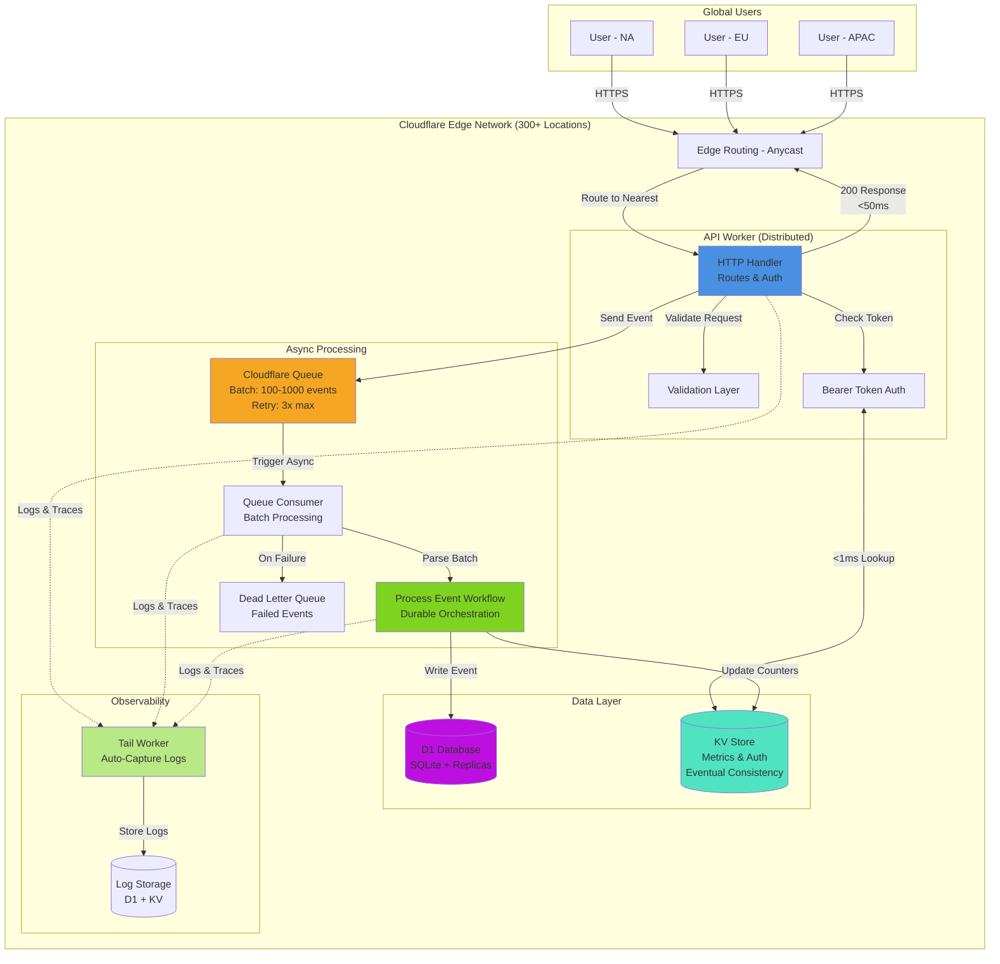
```mermaid
graph TB
    subgraph "Global Users"
        U1[User - NA]
        U2[User - EU]
        U3[User - APAC]
    end

    subgraph "Cloudflare Edge Network (300+ Locations)"
        EDGE[Edge Routing - Anycast]

        subgraph "API Worker (Distributed)"
            API[HTTP Handler<br/>Routes & Auth]
            VALID[Validation Layer]
            AUTH[Bearer Token Auth]
        end

        subgraph "Async Processing"
            QUEUE[Cloudflare Queue<br/>Batch: 100-1000 events<br/>Retry: 3x max]
            CONSUMER[Queue Consumer<br/>Batch Processing]
            WORKFLOW[Process Event Workflow<br/>Durable Orchestration]
            DLQ[Dead Letter Queue<br/>Failed Events]
        end

        subgraph "Data Layer"
            D1[(D1 Database<br/>SQLite + Replicas)]
            KV[("KV Store<br/>Metrics & Auth<br/>Eventual Consistency")]
        end

        subgraph "Observability"
            TAIL[Tail Worker<br/>Auto-Capture Logs]
            LOGS[(Log Storage<br/>D1 + KV)]
        end
    end

    U1 & U2 & U3 -->|HTTPS| EDGE
    EDGE -->|Route to Nearest| API
    API -->|Validate Request| VALID
    API -->|Check Token| AUTH
    AUTH <-->|<1ms Lookup| KV
    API -->|Send Event| QUEUE
    API -->|200 Response<br/>&lt;50ms| EDGE

    QUEUE -->|Trigger Async| CONSUMER
    CONSUMER -->|Parse Batch| WORKFLOW
    WORKFLOW -->|Write Event| D1
    WORKFLOW -->|Update Counters| KV
    CONSUMER -->|On Failure| DLQ

    API -.->|Logs & Traces| TAIL
    CONSUMER -.->|Logs & Traces| TAIL
    WORKFLOW -.->|Logs & Traces| TAIL
    TAIL -->|Store Logs| LOGS

    style API fill:#4A90E2
    style QUEUE fill:#F5A623
    style WORKFLOW fill:#7ED321
    style D1 fill:#BD10E0
    style KV fill:#50E3C2
    style TAIL fill:#B8E986
```

**Legend:**
- **Solid Lines**: Synchronous data flow
- **Dashed Lines**: Asynchronous/observability flow
- **Bold Text**: Critical path components
- **Color Coding**: Blue (API), Orange (Queue), Green (Workflow), Purple (D1), Cyan (KV)

### 1.2 Global Distribution Model

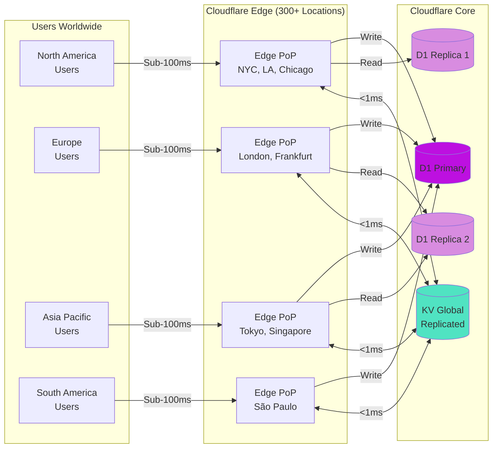
```mermaid
graph LR
    subgraph "Users Worldwide"
        NA[North America<br/>Users]
        EU[Europe<br/>Users]
        APAC[Asia Pacific<br/>Users]
        SA[South America<br/>Users]
    end

    subgraph "Cloudflare Edge (300+ Locations)"
        NA_EDGE[Edge PoP<br/>NYC, LA, Chicago]
        EU_EDGE[Edge PoP<br/>London, Frankfurt]
        APAC_EDGE[Edge PoP<br/>Tokyo, Singapore]
        SA_EDGE[Edge PoP<br/>São Paulo]
    end

    subgraph "Cloudflare Core"
        D1_PRIMARY[(D1 Primary)]
        D1_REPLICA1[(D1 Replica 1)]
        D1_REPLICA2[(D1 Replica 2)]
        KV_GLOBAL[("KV Global<br/>Replicated")]
    end

    NA -->|Sub-100ms| NA_EDGE
    EU -->|Sub-100ms| EU_EDGE
    APAC -->|Sub-100ms| APAC_EDGE
    SA -->|Sub-100ms| SA_EDGE

    NA_EDGE & EU_EDGE & APAC_EDGE & SA_EDGE -->|Write| D1_PRIMARY
    NA_EDGE -->|Read| D1_REPLICA1
    EU_EDGE & APAC_EDGE -->|Read| D1_REPLICA2

    NA_EDGE & EU_EDGE & APAC_EDGE & SA_EDGE <-->|<1ms| KV_GLOBAL

    style D1_PRIMARY fill:#BD10E0
    style D1_REPLICA1 fill:#D88CE0
    style D1_REPLICA2 fill:#D88CE0
    style KV_GLOBAL fill:#50E3C2
```

### 1.3 Communication Patterns

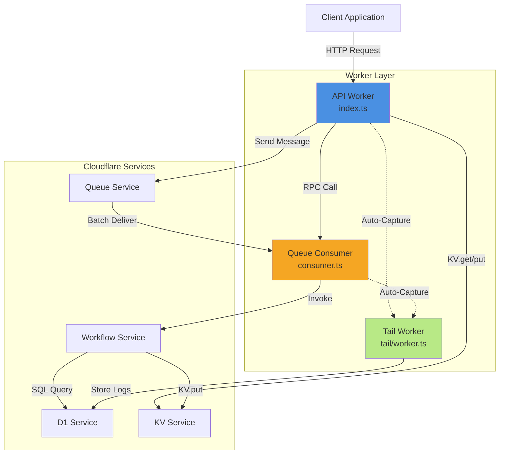
```mermaid
graph TD
    CLIENT[Client Application]

    subgraph "Worker Layer"
        API[API Worker<br/>index.ts]
        QUEUE_WORKER[Queue Consumer<br/>consumer.ts]
        TAIL_WORKER[Tail Worker<br/>tail/worker.ts]
    end

    subgraph "Cloudflare Services"
        QUEUE_SVC[Queue Service]
        WORKFLOW_SVC[Workflow Service]
        D1_SVC[D1 Service]
        KV_SVC[KV Service]
    end

    CLIENT -->|HTTP Request| API
    API -->|RPC Call| QUEUE_WORKER
    API -->|Send Message| QUEUE_SVC
    API -->|KV.get/put| KV_SVC

    QUEUE_SVC -->|Batch Deliver| QUEUE_WORKER
    QUEUE_WORKER -->|Invoke| WORKFLOW_SVC
    WORKFLOW_SVC -->|SQL Query| D1_SVC
    WORKFLOW_SVC -->|KV.put| KV_SVC

    API -.->|Auto-Capture| TAIL_WORKER
    QUEUE_WORKER -.->|Auto-Capture| TAIL_WORKER
    TAIL_WORKER -->|Store Logs| D1_SVC

    style API fill:#4A90E2
    style QUEUE_WORKER fill:#F5A623
    style TAIL_WORKER fill:#B8E986
```

**Communication Types:**
- **HTTP (External)**: Client → API Worker
- **RPC (Internal)**: Worker-to-Worker typed method calls
- **Queue Messages**: Async event-driven triggers
- **Direct Bindings**: API Worker → D1/KV (no HTTP overhead)
- **Auto-Capture**: Tail Worker observability (no explicit calls)

---

## 2. Component Architecture

### 2.1 API Worker

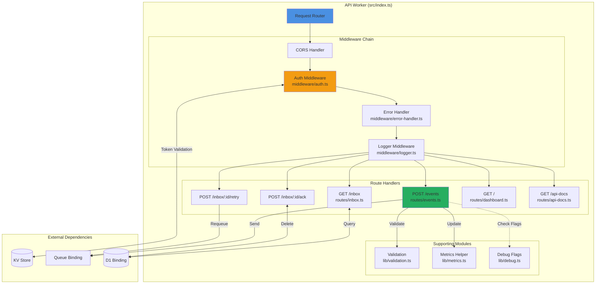
```mermaid
graph TB
    subgraph "API Worker (src/index.ts)"
        ROUTER[Request Router]

        subgraph "Middleware Chain"
            CORS[CORS Handler]
            AUTH_MW[Auth Middleware<br/>middleware/auth.ts]
            ERROR_MW[Error Handler<br/>middleware/error-handler.ts]
            LOG_MW[Logger Middleware<br/>middleware/logger.ts]
        end

        subgraph "Route Handlers"
            EVENTS[POST /events<br/>routes/events.ts]
            INBOX_GET[GET /inbox<br/>routes/inbox.ts]
            INBOX_ACK[POST /inbox/:id/ack]
            INBOX_RETRY[POST /inbox/:id/retry]
            DASHBOARD[GET /<br/>routes/dashboard.ts]
            DOCS[GET /api-docs<br/>routes/api-docs.ts]
        end

        subgraph "Supporting Modules"
            VALIDATION[Validation<br/>lib/validation.ts]
            METRICS[Metrics Helper<br/>lib/metrics.ts]
            DEBUG[Debug Flags<br/>lib/debug.ts]
        end
    end

    subgraph "External Dependencies"
        KV_STORE[("KV Store")]
        QUEUE_BINDING[Queue Binding]
        D1_BINDING[(D1 Binding)]
    end

    ROUTER --> CORS
    CORS --> AUTH_MW
    AUTH_MW --> ERROR_MW
    ERROR_MW --> LOG_MW

    LOG_MW --> EVENTS
    LOG_MW --> INBOX_GET
    LOG_MW --> INBOX_ACK
    LOG_MW --> INBOX_RETRY
    LOG_MW --> DASHBOARD
    LOG_MW --> DOCS

    AUTH_MW <-->|Token Validation| KV_STORE
    EVENTS -->|Validate| VALIDATION
    EVENTS -->|Send| QUEUE_BINDING
    EVENTS -->|Update| METRICS

    INBOX_GET <-->|Query| D1_BINDING
    INBOX_ACK <-->|Delete| D1_BINDING
    INBOX_RETRY -->|Requeue| QUEUE_BINDING

    EVENTS -.->|Check Flags| DEBUG

    style ROUTER fill:#4A90E2
    style AUTH_MW fill:#F39C12
    style EVENTS fill:#27AE60
```

**API Worker Responsibilities:**
- HTTP request handling and routing
- Bearer token authentication via KV
- Request payload validation
- Queue message production
- Structured error responses
- Performance <50ms target for event ingestion

**Key Code Locations:**
- Entry: `src/index.ts`
- Routes: `src/routes/*.ts`
- Middleware: `src/middleware/*.ts`
- Validation: `src/lib/validation.ts`

**Performance Characteristics:**
- Target: <50ms p95 latency for POST /events
- Throughput: 100+ events/second
- Auth overhead: <1ms (KV lookup)
- Zero cold starts (always-on Workers)

### 2.2 Queue Consumer

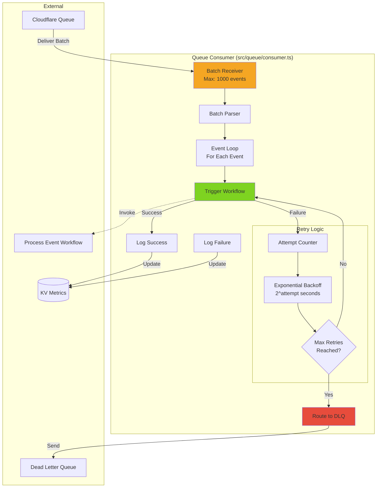
```mermaid
graph TB
    subgraph "Queue Consumer (src/queue/consumer.ts)"
        BATCH_RECEIVER[Batch Receiver<br/>Max: 1000 events]
        PARSER[Batch Parser]
        LOOP[Event Loop<br/>For Each Event]

        subgraph "Retry Logic"
            ATTEMPT[Attempt Counter]
            BACKOFF[Exponential Backoff<br/>2^attempt seconds]
            MAX_RETRY{Max Retries<br/>Reached?}
        end

        WORKFLOW_TRIGGER[Trigger Workflow]
        SUCCESS_LOG[Log Success]
        FAILURE_LOG[Log Failure]
        DLQ_ROUTE[Route to DLQ]
    end

    subgraph "External"
        QUEUE[Cloudflare Queue]
        WORKFLOW[Process Event Workflow]
        DLQ[Dead Letter Queue]
        KV_METRICS[("KV Metrics")]
    end

    QUEUE -->|Deliver Batch| BATCH_RECEIVER
    BATCH_RECEIVER --> PARSER
    PARSER --> LOOP

    LOOP --> WORKFLOW_TRIGGER
    WORKFLOW_TRIGGER -->|Success| SUCCESS_LOG
    WORKFLOW_TRIGGER -->|Failure| ATTEMPT

    ATTEMPT --> BACKOFF
    BACKOFF --> MAX_RETRY
    MAX_RETRY -->|No| WORKFLOW_TRIGGER
    MAX_RETRY -->|Yes| DLQ_ROUTE

    WORKFLOW_TRIGGER -.->|Invoke| WORKFLOW
    DLQ_ROUTE -->|Send| DLQ
    SUCCESS_LOG & FAILURE_LOG -->|Update| KV_METRICS

    style BATCH_RECEIVER fill:#F5A623
    style WORKFLOW_TRIGGER fill:#7ED321
    style DLQ_ROUTE fill:#E74C3C
```

**Queue Consumer Responsibilities:**
- Receive batches from Cloudflare Queue (configurable 100-1000 events)
- Parse and validate batch structure
- Trigger Process Event Workflow for each event
- Handle retry logic with exponential backoff (3 attempts max)
- Route failed events to Dead Letter Queue

**Key Code Location:** `src/queue/consumer.ts`

**Batch Processing Configuration:**
- Default batch size: 100 events
- Maximum batch size: 1000 events
- Processing timeout: 30 seconds per batch
- Retry attempts: 3 (with exponential backoff)

**Scaling:**
- Parallel batch processing across edge locations
- Independent batch handling (no cross-batch dependencies)
- Back-pressure handling via Queue service

### 2.3 Workflow Orchestration

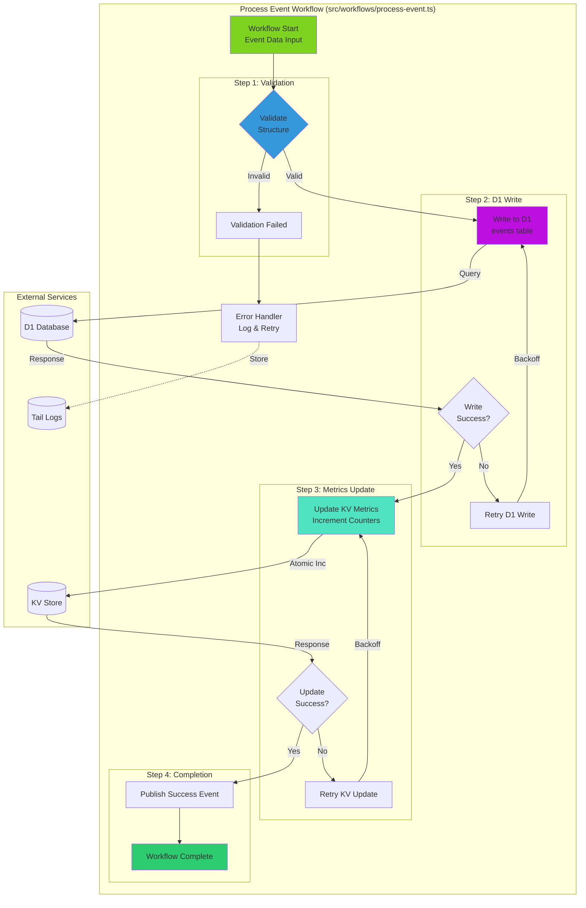
```mermaid
graph TB
    subgraph "Process Event Workflow (src/workflows/process-event.ts)"
        START[Workflow Start<br/>Event Data Input]

        subgraph "Step 1: Validation"
            VALIDATE{Validate<br/>Structure}
            V_FAIL[Validation Failed]
        end

        subgraph "Step 2: D1 Write"
            D1_WRITE[Write to D1<br/>events table]
            D1_SUCCESS{Write<br/>Success?}
            D1_RETRY[Retry D1 Write]
        end

        subgraph "Step 3: Metrics Update"
            KV_UPDATE[Update KV Metrics<br/>Increment Counters]
            KV_SUCCESS{Update<br/>Success?}
            KV_RETRY[Retry KV Update]
        end

        subgraph "Step 4: Completion"
            NOTIFY[Publish Success Event]
            COMPLETE[Workflow Complete]
        end

        ERROR_HANDLER[Error Handler<br/>Log & Retry]
    end

    subgraph "External Services"
        D1[(D1 Database)]
        KV[("KV Store")]
        LOGS[(Tail Logs)]
    end

    START --> VALIDATE
    VALIDATE -->|Valid| D1_WRITE
    VALIDATE -->|Invalid| V_FAIL
    V_FAIL --> ERROR_HANDLER

    D1_WRITE -->|Query| D1
    D1 -->|Response| D1_SUCCESS
    D1_SUCCESS -->|Yes| KV_UPDATE
    D1_SUCCESS -->|No| D1_RETRY
    D1_RETRY -->|Backoff| D1_WRITE

    KV_UPDATE -->|Atomic Inc| KV
    KV -->|Response| KV_SUCCESS
    KV_SUCCESS -->|Yes| NOTIFY
    KV_SUCCESS -->|No| KV_RETRY
    KV_RETRY -->|Backoff| KV_UPDATE

    NOTIFY --> COMPLETE

    ERROR_HANDLER -.->|Store| LOGS

    style START fill:#7ED321
    style VALIDATE fill:#3498DB
    style D1_WRITE fill:#BD10E0
    style KV_UPDATE fill:#50E3C2
    style COMPLETE fill:#2ECC71
```

**Workflow Responsibilities:**
- Multi-step orchestration with guaranteed execution
- Validate event payload and metadata
- Durable write to D1 events table
- Atomic metric updates in KV
- Automatic retry on transient failures
- State persistence across retries

**Key Code Location:** `src/workflows/process-event.ts`

**Workflow Steps:**
1. **Validate Event**: Check required fields (payload present, metadata optional)
2. **Write to D1**: INSERT into events table with status='pending'
3. **Update KV Metrics**: Atomic increment of total/pending counters
4. **Publish Success**: Emit event for downstream consumers (future)

**Guarantees:**
- At-least-once execution (may retry on failure)
- Durable state (survives Worker restarts)
- Automatic retry with exponential backoff
- Timeout: 30 seconds per event

### 2.4 D1 Database Component

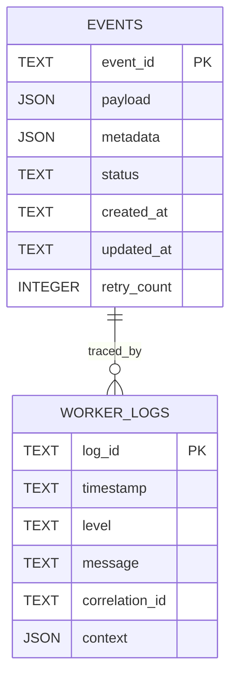
```mermaid
erDiagram
    EVENTS {
        TEXT event_id PK
        JSON payload
        JSON metadata
        TEXT status
        TEXT created_at
        TEXT updated_at
        INTEGER retry_count
    }

    WORKER_LOGS {
        TEXT log_id PK
        TEXT timestamp
        TEXT level
        TEXT message
        TEXT correlation_id
        JSON context
    }

    EVENTS ||--o{ WORKER_LOGS : "traced_by"
```

**D1 Database Schema:**

```sql
-- Events Table (Primary)
CREATE TABLE events (
  event_id TEXT PRIMARY KEY,
  payload JSON NOT NULL,
  metadata JSON,
  status TEXT NOT NULL CHECK(status IN ('pending', 'delivered', 'failed')),
  created_at TEXT NOT NULL,  -- ISO-8601
  updated_at TEXT NOT NULL,  -- ISO-8601
  retry_count INTEGER DEFAULT 0
);

-- Indexes for Fast Queries
CREATE INDEX idx_events_status ON events(status);
CREATE INDEX idx_events_created_at ON events(created_at);
CREATE INDEX idx_events_status_created ON events(status, created_at);

-- Worker Logs Table (Observability)
CREATE TABLE worker_logs (
  log_id TEXT PRIMARY KEY,
  timestamp TEXT NOT NULL,
  level TEXT NOT NULL CHECK(level IN ('debug', 'info', 'warn', 'error')),
  message TEXT NOT NULL,
  correlation_id TEXT,
  context JSON
);

CREATE INDEX idx_logs_timestamp ON worker_logs(timestamp);
CREATE INDEX idx_logs_correlation ON worker_logs(correlation_id);
```

**D1 Component Characteristics:**
- **Storage Engine**: SQLite with Cloudflare management
- **Replication**: Automatic read replicas at edge locations
- **Consistency**: Strong for writes, eventual for reads
- **Query Performance**: <50ms with proper indexes
- **Capacity**: Supports 500MB+ databases (paid plan)

**Key Code Locations:**
- Schema: `src/db/schema.sql`
- Queries: `src/db/queries.ts`
- Initialization: `src/db/initialize.ts`

**Query Patterns:**
- **Inbox Retrieval**: `SELECT * FROM events WHERE status='pending' ORDER BY created_at DESC LIMIT ? OFFSET ?`
- **Event Lookup**: `SELECT * FROM events WHERE event_id = ?`
- **Status Update**: `UPDATE events SET status=?, updated_at=? WHERE event_id=?`
- **Delete (Ack)**: `DELETE FROM events WHERE event_id=?`

### 2.5 KV Store Component

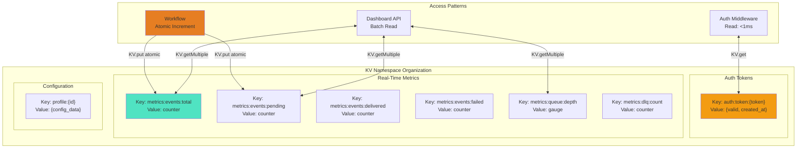
```mermaid
graph TB
    subgraph "KV Namespace Organization"
        subgraph "Auth Tokens"
            AUTH_KEY["Key: auth:token:{token}<br/>Value: {valid, created_at}"]
        end

        subgraph "Real-Time Metrics"
            METRICS_TOTAL["Key: metrics:events:total<br/>Value: counter"]
            METRICS_PENDING["Key: metrics:events:pending<br/>Value: counter"]
            METRICS_DELIVERED["Key: metrics:events:delivered<br/>Value: counter"]
            METRICS_FAILED["Key: metrics:events:failed<br/>Value: counter"]
            QUEUE_DEPTH["Key: metrics:queue:depth<br/>Value: gauge"]
            DLQ_COUNT["Key: metrics:dlq:count<br/>Value: counter"]
        end

        subgraph "Configuration"
            PROFILES["Key: profile:{id}<br/>Value: {config_data}"]
        end
    end

    subgraph "Access Patterns"
        AUTH_READ[Auth Middleware<br/>Read: <1ms]
        METRICS_WRITE[Workflow<br/>Atomic Increment]
        DASHBOARD_READ[Dashboard API<br/>Batch Read]
    end

    AUTH_READ <-->|KV.get| AUTH_KEY
    METRICS_WRITE -->|KV.put atomic| METRICS_TOTAL
    METRICS_WRITE -->|KV.put atomic| METRICS_PENDING
    DASHBOARD_READ <-->|KV.getMultiple| METRICS_TOTAL & METRICS_PENDING & QUEUE_DEPTH

    style AUTH_KEY fill:#F39C12
    style METRICS_TOTAL fill:#50E3C2
    style METRICS_WRITE fill:#E67E22
```

**KV Store Responsibilities:**
- Fast bearer token validation (<1ms lookup)
- Real-time metrics storage (atomic counters)
- Queue state tracking (depth, DLQ count)
- Configuration/profile storage
- Globally distributed caching

**Key Code Location:** `src/lib/metrics.ts`

**Data Categories:**

1. **Auth Tokens** (TTL: 24 hours)
   - Key Pattern: `auth:token:<token>`
   - Value: `{ valid: true, created_at: "2025-11-12T..." }`

2. **Metrics** (No TTL)
   - Total Events: `metrics:events:total`
   - Pending Events: `metrics:events:pending`
   - Delivered Events: `metrics:events:delivered`
   - Failed Events: `metrics:events:failed`
   - Queue Depth: `metrics:queue:depth`
   - DLQ Count: `metrics:dlq:count`

3. **Custom Profiles** (TTL: 30 days)
   - Key Pattern: `profile:<id>`
   - Value: User-defined configuration JSON

**Performance:**
- Read latency: <1ms (global edge cache)
- Write latency: <100ms (propagation time)
- Consistency: Eventual (acceptable for metrics)
- Atomic operations: Supported for safe increments

### 2.6 Tail Worker Component

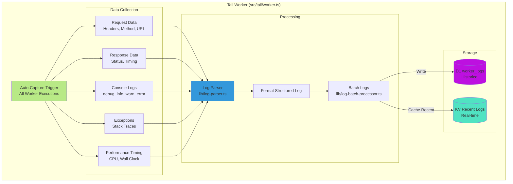
```mermaid
graph TB
    subgraph "Tail Worker (src/tail/worker.ts)"
        CAPTURE[Auto-Capture Trigger<br/>All Worker Executions]

        subgraph "Data Collection"
            REQ_DATA[Request Data<br/>Headers, Method, URL]
            RESP_DATA[Response Data<br/>Status, Timing]
            CONSOLE[Console Logs<br/>debug, info, warn, error]
            EXCEPTIONS[Exceptions<br/>Stack Traces]
            TIMING[Performance Timing<br/>CPU, Wall Clock]
        end

        subgraph "Processing"
            PARSER[Log Parser<br/>lib/log-parser.ts]
            FORMATTER[Format Structured Log]
            BATCH[Batch Logs<br/>lib/log-batch-processor.ts]
        end

        subgraph "Storage"
            D1_LOGS[(D1 worker_logs<br/>Historical)]
            KV_LOGS[("KV Recent Logs<br/>Real-time")]
        end
    end

    CAPTURE --> REQ_DATA & RESP_DATA & CONSOLE & EXCEPTIONS & TIMING

    REQ_DATA & RESP_DATA --> PARSER
    CONSOLE --> PARSER
    EXCEPTIONS --> PARSER
    TIMING --> PARSER

    PARSER --> FORMATTER
    FORMATTER --> BATCH

    BATCH -->|Write| D1_LOGS
    BATCH -->|Cache Recent| KV_LOGS

    style CAPTURE fill:#B8E986
    style PARSER fill:#3498DB
    style D1_LOGS fill:#BD10E0
    style KV_LOGS fill:#50E3C2
```

**Tail Worker Responsibilities:**
- Automatic capture of all Worker executions
- Collect request/response data (headers, timing, status)
- Capture console logs from all Workers
- Track exceptions and errors
- Measure performance metrics (CPU time, latency)
- Store logs for dashboard consumption

**Key Code Locations:**
- Tail Worker: `src/tail/worker.ts`
- Log Parser: `src/lib/log-parser.ts`
- Batch Processor: `src/lib/log-batch-processor.ts`

**Captured Data:**
1. **Request Data**: Method, URL, headers, query params
2. **Response Data**: Status code, headers, timing
3. **Console Logs**: All console.log/warn/error calls
4. **Exceptions**: Unhandled errors with stack traces
5. **Performance**: CPU time, wall-clock time, latency

**Log Structure:**
```json
{
  "log_id": "uuid",
  "timestamp": "2025-11-12T10:30:00Z",
  "level": "info",
  "message": "Event processed successfully",
  "correlation_id": "req-uuid",
  "context": {
    "event_id": "evt-123",
    "status": "success",
    "latency_ms": 45
  }
}
```

**Storage Strategy:**
- **D1**: Historical logs (retention: 7+ days)
- **KV**: Recent logs (last 100, for real-time dashboard)
- **Real-time Delivery**: Logs available to dashboard within 1-2 seconds

**Performance Impact:**
- Overhead: <1% of total execution time
- Async processing: Does not block request handling
- Batch writes: Reduces storage I/O

### 2.7 API Routes Breakdown

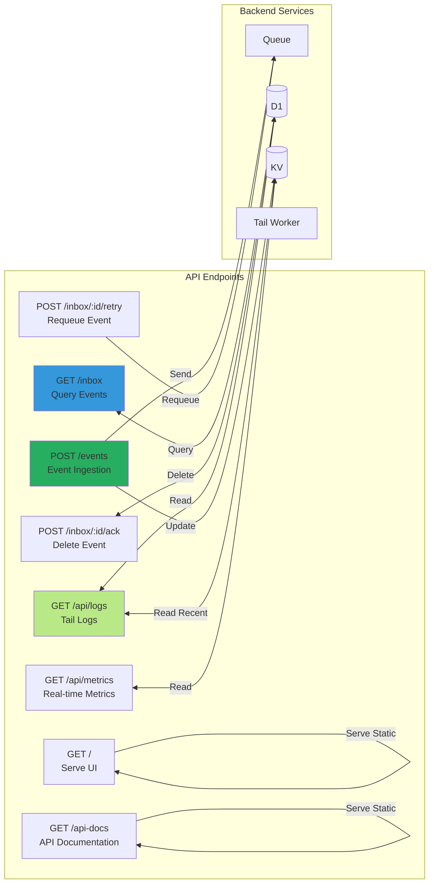
```mermaid
graph LR
    subgraph "API Endpoints"
        EVENTS[POST /events<br/>Event Ingestion]
        INBOX_GET[GET /inbox<br/>Query Events]
        INBOX_ACK[POST /inbox/:id/ack<br/>Delete Event]
        INBOX_RETRY[POST /inbox/:id/retry<br/>Requeue Event]
        DASHBOARD[GET /<br/>Serve UI]
        DOCS[GET /api-docs<br/>API Documentation]
        LOGS_API[GET /api/logs<br/>Tail Logs]
        METRICS_API[GET /api/metrics<br/>Real-time Metrics]
    end

    subgraph "Backend Services"
        QUEUE[Queue]
        D1[(D1)]
        KV[("KV")]
        TAIL[Tail Worker]
    end

    EVENTS -->|Send| QUEUE
    EVENTS -->|Update| KV

    INBOX_GET <-->|Query| D1
    INBOX_ACK <-->|Delete| D1
    INBOX_RETRY -->|Requeue| QUEUE

    LOGS_API <-->|Read| D1
    LOGS_API <-->|Read Recent| KV
    METRICS_API <-->|Read| KV

    DASHBOARD -->|Serve Static| DASHBOARD
    DOCS -->|Serve Static| DOCS

    style EVENTS fill:#27AE60
    style INBOX_GET fill:#3498DB
    style LOGS_API fill:#B8E986
```

**Route Details:**

| Route | Method | Purpose | Auth | Response Time | Code Location |
|-------|--------|---------|------|---------------|---------------|
| `/events` | POST | Ingest events | Required | <50ms | `src/routes/events.ts` |
| `/inbox` | GET | Query events with filters | Required | <200ms | `src/routes/inbox.ts` |
| `/inbox/:id/ack` | POST | Acknowledge and delete | Required | <150ms | `src/routes/inbox.ts` |
| `/inbox/:id/retry` | POST | Requeue failed event | Required | <100ms | `src/routes/inbox.ts` |
| `/` | GET | Dashboard UI | Optional | <50ms | `src/routes/dashboard.ts` |
| `/api-docs` | GET | API documentation | Optional | <30ms | `src/routes/api-docs.ts` |
| `/api/logs` | GET | Tail Worker logs | Required | <100ms | `src/routes/logs-api.ts` |
| `/api/metrics` | GET | Real-time metrics | Required | <50ms | `src/lib/metrics.ts` |

---

## 3. Data Flow Diagrams

### 3.1 Event Ingestion Flow

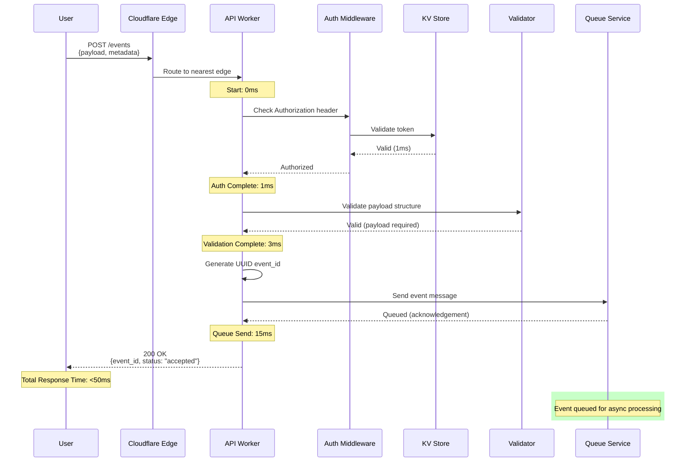
```mermaid
sequenceDiagram
    participant User
    participant Edge as Cloudflare Edge
    participant API as API Worker
    participant Auth as Auth Middleware
    participant KV as KV Store
    participant Valid as Validator
    participant Queue as Queue Service

    User->>Edge: POST /events<br/>{payload, metadata}
    Edge->>API: Route to nearest edge

    Note over API: Start: 0ms

    API->>Auth: Check Authorization header
    Auth->>KV: Validate token
    KV-->>Auth: Valid (1ms)
    Auth-->>API: Authorized

    Note over API: Auth Complete: 1ms

    API->>Valid: Validate payload structure
    Valid-->>API: Valid (payload required)

    Note over API: Validation Complete: 3ms

    API->>API: Generate UUID event_id
    API->>Queue: Send event message
    Queue-->>API: Queued (acknowledgement)

    Note over API: Queue Send: 15ms

    API-->>User: 200 OK<br/>{event_id, status: "accepted"}

    Note over User: Total Response Time: <50ms

    rect rgb(200, 255, 200)
        Note over Queue: Event queued for async processing
    end
```

**Flow Steps:**
1. **User Request** → POST /events with JSON payload
2. **Edge Routing** → Anycast routes to nearest Cloudflare location
3. **Auth Check** → Bearer token validated via KV (<1ms)
4. **Validation** → Payload structure verified (payload required, metadata optional)
5. **Event ID** → UUID v4 generated for tracking
6. **Queue Send** → Event sent to Cloudflare Queue (~10-15ms)
7. **Response** → 200 OK with event_id and "accepted" status

**Timing Breakdown:**
- Auth: 1ms
- Validation: 2ms
- UUID generation: <1ms
- Queue send: 10-15ms
- Total: <50ms at p95

**Error Paths:**
- **400 Bad Request**: Malformed JSON or missing payload field
- **401 Unauthorized**: Invalid or missing Bearer token
- **503 Service Unavailable**: Queue temporarily unavailable

### 3.2 Event Processing & Storage Flow

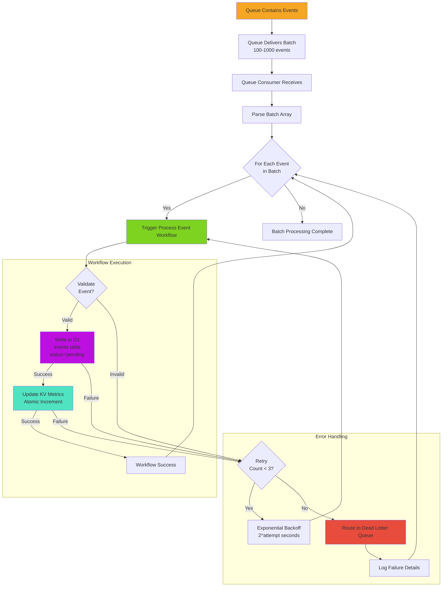
```mermaid
flowchart TD
    START[Queue Contains Events]

    BATCH[Queue Delivers Batch<br/>100-1000 events]
    CONSUMER[Queue Consumer Receives]
    PARSE[Parse Batch Array]

    LOOP_START{For Each Event<br/>in Batch}

    TRIGGER[Trigger Process Event Workflow]

    subgraph "Workflow Execution"
        W_VALIDATE{Validate<br/>Event?}
        W_D1[Write to D1<br/>events table<br/>status='pending']
        W_KV[Update KV Metrics<br/>Atomic Increment]
        W_SUCCESS[Workflow Success]
    end

    subgraph "Error Handling"
        RETRY_CHECK{Retry<br/>Count < 3?}
        BACKOFF[Exponential Backoff<br/>2^attempt seconds]
        DLQ[Route to Dead Letter Queue]
        ERROR_LOG[Log Failure Details]
    end

    BATCH_COMPLETE[Batch Processing Complete]

    START --> BATCH
    BATCH --> CONSUMER
    CONSUMER --> PARSE
    PARSE --> LOOP_START

    LOOP_START -->|Yes| TRIGGER
    LOOP_START -->|No| BATCH_COMPLETE

    TRIGGER --> W_VALIDATE
    W_VALIDATE -->|Valid| W_D1
    W_VALIDATE -->|Invalid| RETRY_CHECK

    W_D1 -->|Success| W_KV
    W_D1 -->|Failure| RETRY_CHECK

    W_KV -->|Success| W_SUCCESS
    W_KV -->|Failure| RETRY_CHECK

    W_SUCCESS --> LOOP_START

    RETRY_CHECK -->|Yes| BACKOFF
    BACKOFF --> TRIGGER

    RETRY_CHECK -->|No| DLQ
    DLQ --> ERROR_LOG
    ERROR_LOG --> LOOP_START

    style START fill:#F5A623
    style TRIGGER fill:#7ED321
    style W_D1 fill:#BD10E0
    style W_KV fill:#50E3C2
    style DLQ fill:#E74C3C
```

**Processing Steps:**
1. **Batch Delivery** → Queue delivers batch (configurable size)
2. **Parse Batch** → Extract individual events from array
3. **Workflow Trigger** → For each event, invoke Process Event Workflow
4. **Validate** → Check event structure (payload required)
5. **D1 Write** → INSERT into events table with status='pending'
6. **KV Update** → Atomic increment of metrics counters
7. **Success** → Event marked as processed

**Retry Logic:**
- Max retries: 3
- Backoff: 2^attempt seconds (1s, 2s, 4s)
- On max retries exceeded → Route to DLQ

**Timing:**
- Queue delivery: Near-instant to <5 seconds
- Workflow execution: <5 seconds per event
- Total: <10 seconds end-to-end (ingestion → storage)

### 3.3 Event Retrieval Flow

```mermaid
flowchart LR
    USER[User/Dashboard]

    subgraph "Request Processing"
        REQ[GET /inbox?status=pending<br/>&from=2025-11-10<br/>&to=2025-11-12<br/>&limit=50&offset=0]
        AUTH[Auth Check<br/>Bearer Token]
        QUERY_BUILD[Build SQL Query]
    end

    subgraph "Database Layer"
        D1_QUERY[D1 Execute:<br/>SELECT * FROM events<br/>WHERE status='pending'<br/>AND created_at BETWEEN ? AND ?<br/>ORDER BY created_at DESC<br/>LIMIT 50 OFFSET 0]
        INDEX[Use Index:<br/>idx_events_status_created]
        RESULTS[Query Results<br/>50 rows + total count]
    end

    subgraph "Response Formatting"
        FORMAT[Format to API Response:<br/>{events: [...],<br/>total: N,<br/>limit: 50,<br/>offset: 0}]
        RESPONSE[200 OK<br/>JSON Response]
    end

    USER --> REQ
    REQ --> AUTH
    AUTH -->|Valid| QUERY_BUILD
    QUERY_BUILD --> D1_QUERY
    D1_QUERY --> INDEX
    INDEX --> RESULTS
    RESULTS --> FORMAT
    FORMAT --> RESPONSE
    RESPONSE --> USER

    style AUTH fill:#F39C12
    style D1_QUERY fill:#BD10E0
    style INDEX fill:#E67E22
    style RESPONSE fill:#27AE60
```

**Query Flow:**
1. **Request** → GET /inbox with filters (status, from, to, limit, offset)
2. **Auth** → Validate Bearer token via KV
3. **Query Build** → Construct SQL WHERE clause from filters
4. **D1 Query** → Execute SELECT with appropriate indexes
5. **Results** → Fetch events array + total count
6. **Format** → Transform to API response structure
7. **Response** → Return 200 OK with paginated results

**Performance Optimization:**
- **Indexes Used**: `idx_events_status_created` for combined status + timestamp queries
- **Query Time**: <50ms with proper indexes
- **Total Response**: <200ms at p95

**Filter Support:**
- `status`: pending | delivered | failed
- `from`: ISO-8601 timestamp (created_at >= from)
- `to`: ISO-8601 timestamp (created_at <= to)
- `limit`: Max results (default: 50, max: 1000)
- `offset`: Pagination offset

### 3.4 Event Acknowledgment Flow

```mermaid
flowchart TD
    USER[User: Acknowledge Event]

    REQ[POST /inbox/:id/ack]
    AUTH[Auth Check]
    VALIDATE_ID{Event ID<br/>Valid UUID?}

    WORKFLOW_TRIGGER[Trigger Delete Workflow]

    subgraph "Workflow Steps"
        D1_DELETE[D1: DELETE FROM events<br/>WHERE event_id = ?]
        DELETE_CHECK{Row<br/>Deleted?}
        KV_DECREMENT[KV: Decrement<br/>pending counter]
        KV_INCREMENT[KV: Increment<br/>delivered counter]
    end

    SUCCESS[200 OK<br/>{event_id, status: "deleted"}]
    ERROR_404[404 Not Found<br/>Event does not exist]

    USER --> REQ
    REQ --> AUTH
    AUTH -->|Valid| VALIDATE_ID

    VALIDATE_ID -->|Valid| WORKFLOW_TRIGGER
    VALIDATE_ID -->|Invalid| ERROR_404

    WORKFLOW_TRIGGER --> D1_DELETE
    D1_DELETE --> DELETE_CHECK

    DELETE_CHECK -->|1 row| KV_DECREMENT
    DELETE_CHECK -->|0 rows| ERROR_404

    KV_DECREMENT --> KV_INCREMENT
    KV_INCREMENT --> SUCCESS
    SUCCESS --> USER
    ERROR_404--> USER

    style AUTH fill:#F39C12
    style D1_DELETE fill:#BD10E0
    style KV_DECREMENT fill:#50E3C2
    style SUCCESS fill:#27AE60
    style ERROR_404 fill:#E74C3C
```

**Acknowledgment Flow:**
1. **Request** → POST /inbox/:id/ack
2. **Auth** → Validate Bearer token
3. **Validate ID** → Check UUID format
4. **Workflow Trigger** → Invoke delete workflow
5. **D1 Delete** → DELETE FROM events WHERE event_id = :id
6. **Check Result** → Verify row was deleted (0 = not found)
7. **Update Metrics** → Decrement pending, increment delivered
8. **Response** → 200 OK with confirmation

**Timing:** <150ms at p95

**Error Cases:**
- **404 Not Found**: Event ID does not exist
- **400 Bad Request**: Invalid UUID format
- **401 Unauthorized**: Invalid token

### 3.5 Observability Data Collection Flow

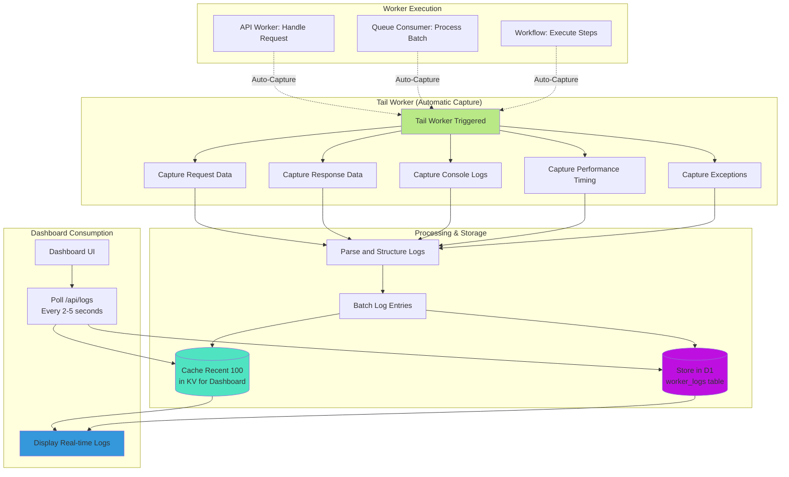
```mermaid
flowchart TD
    subgraph "Worker Execution"
        API_REQ[API Worker: Handle Request]
        QUEUE_PROC[Queue Consumer: Process Batch]
        WORKFLOW_EXEC[Workflow: Execute Steps]
    end

    subgraph "Tail Worker (Automatic Capture)"
        TAIL_TRIGGER[Tail Worker Triggered]
        CAPTURE_REQ[Capture Request Data]
        CAPTURE_RESP[Capture Response Data]
        CAPTURE_LOGS[Capture Console Logs]
        CAPTURE_TIMING[Capture Performance Timing]
        CAPTURE_ERRORS[Capture Exceptions]
    end

    subgraph "Processing & Storage"
        PARSE[Parse and Structure Logs]
        BATCH_LOGS[Batch Log Entries]

        D1_STORE[(Store in D1<br/>worker_logs table)]
        KV_CACHE[("Cache Recent 100<br/>in KV for Dashboard")]
    end

    subgraph "Dashboard Consumption"
        DASHBOARD[Dashboard UI]
        POLL[Poll /api/logs<br/>Every 2-5 seconds]
        DISPLAY[Display Real-time Logs]
    end

    API_REQ & QUEUE_PROC & WORKFLOW_EXEC -.->|Auto-Capture| TAIL_TRIGGER

    TAIL_TRIGGER --> CAPTURE_REQ
    TAIL_TRIGGER --> CAPTURE_RESP
    TAIL_TRIGGER --> CAPTURE_LOGS
    TAIL_TRIGGER --> CAPTURE_TIMING
    TAIL_TRIGGER --> CAPTURE_ERRORS

    CAPTURE_REQ & CAPTURE_RESP & CAPTURE_LOGS & CAPTURE_TIMING & CAPTURE_ERRORS --> PARSE

    PARSE --> BATCH_LOGS
    BATCH_LOGS --> D1_STORE
    BATCH_LOGS --> KV_CACHE

    DASHBOARD --> POLL
    POLL --> KV_CACHE
    POLL --> D1_STORE
    KV_CACHE & D1_STORE --> DISPLAY

    style TAIL_TRIGGER fill:#B8E986
    style D1_STORE fill:#BD10E0
    style KV_CACHE fill:#50E3C2
    style DISPLAY fill:#3498DB
```

**Observability Flow:**
1. **Worker Execution** → Any Worker execution (API, Queue, Workflow)
2. **Auto-Capture** → Tail Worker automatically triggered
3. **Data Collection** → Request, response, logs, timing, errors captured
4. **Parse & Structure** → Format into structured log entries
5. **Batch** → Group logs for efficient storage
6. **Storage** → Write to D1 (historical) and KV (recent 100)
7. **Dashboard Poll** → UI polls /api/logs every 2-5 seconds
8. **Display** → Real-time log stream in dashboard

**Data Captured:**
- Request: Method, URL, headers, query params
- Response: Status code, timing, headers
- Console Logs: All console.log/warn/error calls
- Timing: CPU time, wall-clock time, latency
- Errors: Unhandled exceptions with stack traces

**Latency:** Logs available to dashboard within 1-2 seconds

### 3.6 Debug Flow

```mermaid
flowchart TD
    USER[User Request with Debug Flag]

    CHECK_DEBUG{Debug Param<br/>Present?}

    subgraph "Debug Flag Handlers"
        VALIDATION_ERROR[debug=validation_error<br/>Return 400 with sample error]
        PROCESSING_ERROR[debug=processing_error<br/>Queue event, then return 500]
        QUEUE_DELAY[debug=queue_delay<br/>Inject 2-second delay]
        DLQ_ROUTING[debug=dlq_routing<br/>Force event to DLQ]
    end

    NORMAL_FLOW[Normal Processing]

    subgraph "Debug Responses"
        RESP_400[400 Bad Request<br/>{error: "Validation failed"}]
        RESP_500[500 Internal Server Error<br/>{error: "Processing failed"}]
        RESP_200_DELAYED[200 OK (after 2s delay)<br/>{event_id, debug: true}]
        RESP_200_DLQ[200 OK<br/>{event_id, routed_to: "dlq"}]
    end

    USER --> CHECK_DEBUG

    CHECK_DEBUG -->|validation_error| VALIDATION_ERROR
    CHECK_DEBUG -->|processing_error| PROCESSING_ERROR
    CHECK_DEBUG -->|queue_delay| QUEUE_DELAY
    CHECK_DEBUG -->|dlq_routing| DLQ_ROUTING
    CHECK_DEBUG -->|None| NORMAL_FLOW

    VALIDATION_ERROR --> RESP_400
    PROCESSING_ERROR --> RESP_500
    QUEUE_DELAY --> RESP_200_DELAYED
    DLQ_ROUTING --> RESP_200_DLQ

    RESP_400 & RESP_500 & RESP_200_DELAYED & RESP_200_DLQ --> USER

    style CHECK_DEBUG fill:#F39C12
    style VALIDATION_ERROR fill:#E74C3C
    style PROCESSING_ERROR fill:#E74C3C
    style QUEUE_DELAY fill:#F5A623
    style DLQ_ROUTING fill:#E67E22
```

**Debug Flags:**

1. **validation_error**
   - Triggers: Immediate validation failure
   - Response: 400 Bad Request
   - Use case: Test error handling UI

2. **processing_error**
   - Triggers: Event queued, then simulated processing error
   - Response: 500 Internal Server Error
   - Use case: Test retry and DLQ logic

3. **queue_delay**
   - Triggers: Artificial 2-second delay before response
   - Response: 200 OK (delayed)
   - Use case: Test latency handling and loading states

4. **dlq_routing**
   - Triggers: Event immediately routed to Dead Letter Queue
   - Response: 200 OK with DLQ routing info
   - Use case: Test DLQ monitoring and recovery

**Implementation:** Checked in route handler BEFORE normal logic (see `src/lib/debug.ts`)

---

## 4. Sequence Diagrams for Key Operations

### 4.1 Successful Event Ingestion Sequence

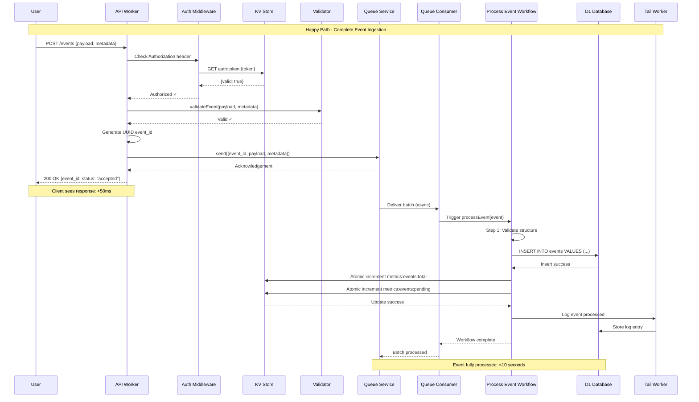
```mermaid
sequenceDiagram
    participant User
    participant API as API Worker
    participant Auth as Auth Middleware
    participant KV as KV Store
    participant Valid as Validator
    participant Queue as Queue Service
    participant Consumer as Queue Consumer
    participant Workflow as Process Event Workflow
    participant D1 as D1 Database
    participant Tail as Tail Worker

    Note over User,Tail: Happy Path - Complete Event Ingestion

    User->>API: POST /events {payload, metadata}

    API->>Auth: Check Authorization header
    Auth->>KV: GET auth:token:{token}
    KV-->>Auth: {valid: true}
    Auth-->>API: Authorized ✓

    API->>Valid: validateEvent(payload, metadata)
    Valid-->>API: Valid ✓

    API->>API: Generate UUID event_id
    API->>Queue: send({event_id, payload, metadata})
    Queue-->>API: Acknowledgement

    API-->>User: 200 OK {event_id, status: "accepted"}
    Note over User,API: Client sees response: <50ms

    Queue->>Consumer: Deliver batch (async)
    Consumer->>Workflow: Trigger processEvent(event)

    Workflow->>Workflow: Step 1: Validate structure
    Workflow->>D1: INSERT INTO events VALUES (...)
    D1-->>Workflow: Insert success

    Workflow->>KV: Atomic increment metrics:events:total
    Workflow->>KV: Atomic increment metrics:events:pending
    KV-->>Workflow: Update success

    Workflow->>Tail: Log event processed
    Tail->>D1: Store log entry

    Workflow-->>Consumer: Workflow complete
    Consumer-->>Queue: Batch processed

    Note over Queue,D1: Event fully processed: <10 seconds
```

**Timeline:**
- **0ms**: User sends request
- **1ms**: Auth validated via KV
- **3ms**: Payload validated
- **15ms**: Event queued
- **<50ms**: User receives 200 OK response
- **5 seconds**: Queue delivers batch
- **<10 seconds**: Event stored in D1 and metrics updated

### 4.2 Event Processing with Retry Sequence

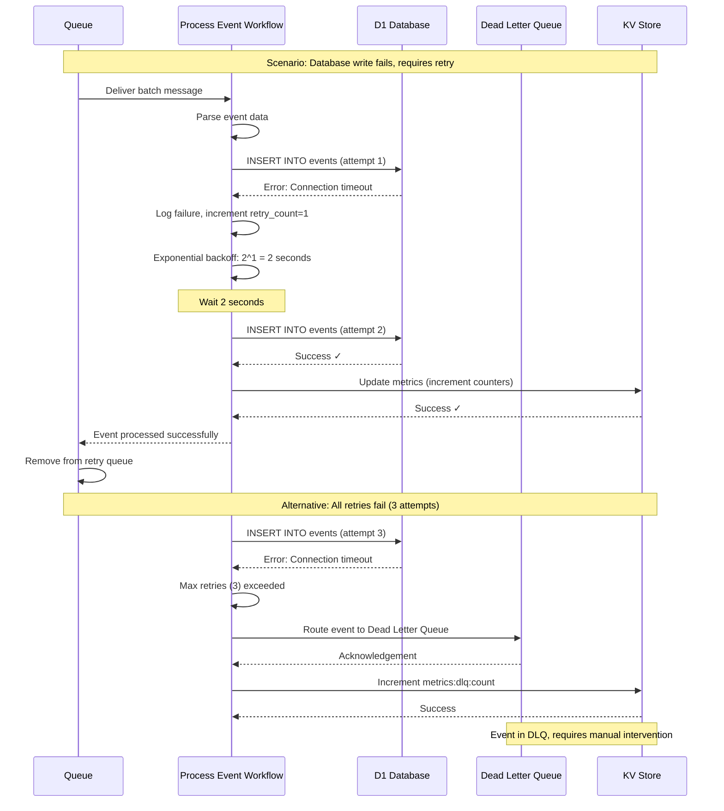
```mermaid
sequenceDiagram
    participant Queue
    participant Workflow as Process Event Workflow
    participant D1 as D1 Database
    participant DLQ as Dead Letter Queue
    participant KV as KV Store

    Note over Queue,KV: Scenario: Database write fails, requires retry

    Queue->>Workflow: Deliver batch message
    Workflow->>Workflow: Parse event data

    Workflow->>D1: INSERT INTO events (attempt 1)
    D1-->>Workflow: Error: Connection timeout

    Workflow->>Workflow: Log failure, increment retry_count=1
    Workflow->>Workflow: Exponential backoff: 2^1 = 2 seconds

    Note over Workflow: Wait 2 seconds

    Workflow->>D1: INSERT INTO events (attempt 2)
    D1-->>Workflow: Success ✓

    Workflow->>KV: Update metrics (increment counters)
    KV-->>Workflow: Success ✓

    Workflow-->>Queue: Event processed successfully
    Queue->>Queue: Remove from retry queue

    Note over Queue,KV: Alternative: All retries fail (3 attempts)

    Workflow->>D1: INSERT INTO events (attempt 3)
    D1-->>Workflow: Error: Connection timeout

    Workflow->>Workflow: Max retries (3) exceeded
    Workflow->>DLQ: Route event to Dead Letter Queue
    DLQ-->>Workflow: Acknowledgement

    Workflow->>KV: Increment metrics:dlq:count
    KV-->>Workflow: Success

    Note over DLQ,KV: Event in DLQ, requires manual intervention
```

**Retry Logic:**
- **Max Retries**: 3 attempts
- **Backoff**: Exponential (2^attempt seconds)
  - Attempt 1: Immediate
  - Attempt 2: After 2 seconds
  - Attempt 3: After 4 seconds
- **On Failure**: Route to DLQ after 3 failed attempts

### 4.3 Inbox Query Sequence

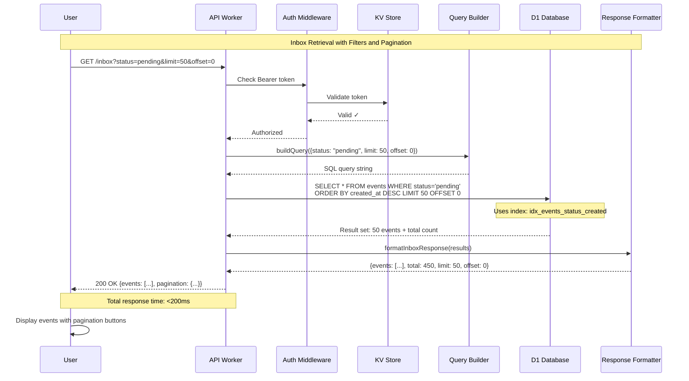
```mermaid
sequenceDiagram
    participant User
    participant API as API Worker
    participant Auth as Auth Middleware
    participant KV as KV Store
    participant QueryBuilder as Query Builder
    participant D1 as D1 Database
    participant Formatter as Response Formatter

    Note over User,Formatter: Inbox Retrieval with Filters and Pagination

    User->>API: GET /inbox?status=pending&limit=50&offset=0

    API->>Auth: Check Bearer token
    Auth->>KV: Validate token
    KV-->>Auth: Valid ✓
    Auth-->>API: Authorized

    API->>QueryBuilder: buildQuery({status: "pending", limit: 50, offset: 0})
    QueryBuilder-->>API: SQL query string

    API->>D1: SELECT * FROM events WHERE status='pending'<br/>ORDER BY created_at DESC LIMIT 50 OFFSET 0
    Note over D1: Uses index: idx_events_status_created
    D1-->>API: Result set: 50 events + total count

    API->>Formatter: formatInboxResponse(results)
    Formatter-->>API: {events: [...], total: 450, limit: 50, offset: 0}

    API-->>User: 200 OK {events: [...], pagination: {...}}

    Note over User,API: Total response time: <200ms

    User->>User: Display events with pagination buttons
```

**Query Performance:**
- **Auth**: <1ms (KV lookup)
- **Query Build**: <1ms (string construction)
- **D1 Query**: <50ms (with indexes)
- **Format**: <10ms (JSON transformation)
- **Total**: <200ms at p95

### 4.4 Event Acknowledgment Sequence

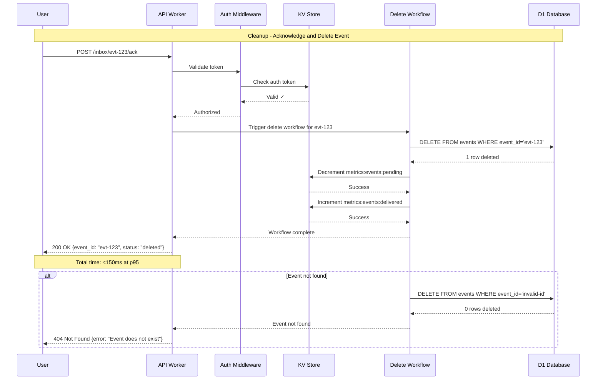
```mermaid
sequenceDiagram
    participant User
    participant API as API Worker
    participant Auth as Auth Middleware
    participant KV as KV Store
    participant Workflow as Delete Workflow
    participant D1 as D1 Database

    Note over User,D1: Cleanup - Acknowledge and Delete Event

    User->>API: POST /inbox/evt-123/ack

    API->>Auth: Validate token
    Auth->>KV: Check auth token
    KV-->>Auth: Valid ✓
    Auth-->>API: Authorized

    API->>Workflow: Trigger delete workflow for evt-123

    Workflow->>D1: DELETE FROM events WHERE event_id='evt-123'
    D1-->>Workflow: 1 row deleted

    Workflow->>KV: Decrement metrics:events:pending
    KV-->>Workflow: Success

    Workflow->>KV: Increment metrics:events:delivered
    KV-->>Workflow: Success

    Workflow-->>API: Workflow complete
    API-->>User: 200 OK {event_id: "evt-123", status: "deleted"}

    Note over User,API: Total time: <150ms at p95

    alt Event not found
        Workflow->>D1: DELETE FROM events WHERE event_id='invalid-id'
        D1-->>Workflow: 0 rows deleted
        Workflow-->>API: Event not found
        API-->>User: 404 Not Found {error: "Event does not exist"}
    end
```

**Success Path:**
- DELETE query executes successfully (1 row affected)
- Metrics updated (pending decremented, delivered incremented)
- 200 OK response with confirmation

**Error Path:**
- DELETE query returns 0 rows (event not found)
- 404 Not Found response
- No metric updates

### 4.5 Error Path - Validation Failure

```mermaid
sequenceDiagram
    participant User
    participant API as API Worker
    participant Parser as JSON Parser
    participant ErrorHandler as Error Handler
    participant KV as KV Store
    participant Tail as Tail Worker
    participant D1 as D1 Logs

    Note over User,D1: Error Path - Invalid Payload

    User->>API: POST /events {malformed JSON}

    API->>Parser: Parse request body
    Parser-->>API: SyntaxError: Unexpected token

    API->>ErrorHandler: Catch and format error
    ErrorHandler->>ErrorHandler: Generate correlation_id
    ErrorHandler->>ErrorHandler: Create structured error response

    ErrorHandler->>Tail: Log validation error
    Tail->>D1: Store error log with correlation_id

    ErrorHandler->>KV: Increment metrics:errors:validation
    KV-->>ErrorHandler: Success

    ErrorHandler-->>API: Formatted error object
    API-->>User: 400 Bad Request<br/>{error: {<br/>  code: "INVALID_PAYLOAD",<br/>  message: "Invalid JSON",<br/>  correlation_id: "uuid",<br/>  timestamp: "2025-11-12T..."<br/>}}

    Note over User,API: No queue message created (failed validation)
```

**Error Response Structure:**
```json
{
  "error": {
    "code": "INVALID_PAYLOAD",
    "message": "Invalid JSON: Unexpected token at position 15",
    "timestamp": "2025-11-12T10:30:00Z",
    "correlation_id": "550e8400-e29b-41d4-a716-446655440000"
  }
}
```

**Error Codes:**
- `INVALID_PAYLOAD`: Malformed JSON or missing required fields
- `UNAUTHORIZED`: Invalid or missing Bearer token
- `NOT_FOUND`: Resource does not exist
- `CONFLICT`: Operation not allowed in current state
- `INTERNAL_ERROR`: Unexpected server failure

---

## 5. Technology Stack Overview

### 5.1 Runtime Environment

| Component | Technology | Version | Purpose |
|-----------|------------|---------|---------|
| **Runtime** | Cloudflare Workers | Latest | JavaScript/TypeScript execution at edge |
| **Execution Model** | Event-driven | N/A | Request-based invocation |
| **Memory** | 128MB per instance | N/A | Per-request isolation |
| **CPU Time** | 50ms per request | Paid plan | Compute budget per execution |
| **Cold Start** | Zero (always ready) | N/A | Workers pre-warmed globally |
| **Deployment** | 300+ edge locations | Global | Distributed to all Cloudflare PoPs |

**Performance Characteristics:**
- **Latency**: Sub-100ms globally (nearest edge processing)
- **Throughput**: Unlimited (auto-scaling)
- **Availability**: 99.99%+ SLA (Cloudflare managed)
- **Cost**: Pay-per-request pricing

### 5.2 Core Services Stack

| Service | Provider | Purpose | Code Integration |
|---------|----------|---------|------------------|
| **Workers** | Cloudflare | HTTP server runtime | `src/index.ts`, `src/routes/` |
| **Queue** | Cloudflare Queues | Async message processing | Binding in `wrangler.toml` |
| **Workflows** | Cloudflare Workflows | Durable orchestration | `src/workflows/process-event.ts` |
| **D1** | Cloudflare D1 | SQLite at edge | `src/db/schema.sql`, `src/db/queries.ts` |
| **KV** | Cloudflare KV | Distributed key-value | `src/lib/metrics.ts` |
| **Tail Workers** | Cloudflare | Observability capture | `src/tail/worker.ts` |
| **RPC** | Cloudflare | Worker-to-Worker calls | TypeScript service bindings |

### 5.3 Language & Frameworks

| Layer | Technology | Version | Rationale |
|-------|------------|---------|-----------|
| **Language** | TypeScript | 5.x | Type safety, excellent Cloudflare support |
| **Type Mode** | Strict | N/A | Enforce strict null checks, no implicit any |
| **UI Framework** | React | 18.x | Component-based UI with shadcn components |
| **UI Components** | shadcn/ui | Latest | Pre-built accessible components |
| **Styling** | Tailwind CSS | 3.x | Utility-first CSS framework |
| **Build Tool** | Wrangler CLI | Latest | Official Cloudflare deployment tool |
| **Package Manager** | npm/pnpm | Latest | Dependency management |
| **Runtime Compat** | Node.js-compatible | N/A | Via Cloudflare Workers runtime |

### 5.4 Development Tools

| Tool | Purpose | Integration |
|------|---------|-------------|
| **Wrangler** | Local dev & deployment | `npx wrangler dev`, `npx wrangler deploy` |
| **Vitest** | Lightweight testing | `test/` directory (optional coverage) |
| **ESLint** | Code quality checks | Pre-commit hooks |
| **Prettier** | Code formatting | Auto-format on save |
| **TypeScript Compiler** | Type checking | `tsc --noEmit` for validation |
| **Local Dev** | Emulation | `wrangler dev` with local bindings |

### 5.5 Dependencies

**Minimal External Dependencies** (platform-first approach):

```json
{
  "dependencies": {
    "hono": "^4.x",           // Optional: Lightweight HTTP framework
    "zod": "^3.x"             // Schema validation for type safety
  },
  "devDependencies": {
    "@cloudflare/workers-types": "^4.x",
    "@types/react": "^18.x",
    "@types/react-dom": "^18.x",
    "react": "^18.x",
    "react-dom": "^18.x",
    "tailwindcss": "^3.x",
    "typescript": "^5.x",
    "wrangler": "^3.x"
  }
}
```

**Cloudflare Bindings** (zero-install platform features):
- `D1Database`: Type-safe D1 database access
- `KVNamespace`: Key-value storage binding
- `Queue`: Queue producer/consumer binding
- `Workflow`: Durable workflow runtime

### 5.6 Infrastructure & Deployment

| Layer | Technology | Configuration |
|-------|------------|---------------|
| **Hosting** | Cloudflare Edge | 300+ global locations |
| **Database** | D1 with auto-replicas | `wrangler.toml` binding |
| **Cache** | KV global distribution | Eventual consistency model |
| **Queue** | Cloudflare Queues | At-least-once delivery |
| **CI/CD** | GitHub Actions (optional) | `wrangler deploy` integration |
| **Secrets** | Environment variables | Cloudflare dashboard config |
| **Monitoring** | Tail Workers + Dashboard | Built-in observability |

---

## 6. Design Decisions & Trade-offs

### 6.1 Single Worker vs Microservices

**Decision:** Single Worker deployment with function-based separation

**Rationale:**
- **Simplicity**: Single deployment unit, easier to manage and debug
- **Performance**: Zero inter-service latency (no HTTP calls between Workers)
- **Cost**: Lower resource usage (shared runtime environment)
- **Sufficient Scale**: Handles 100+ events/second target easily

**Trade-offs:**
- ❌ **Less Isolation**: Components share same runtime and resource limits
- ❌ **Monolithic**: Changes require full Worker redeployment
- ✅ **Acceptable**: For this use case scale, benefits outweigh drawbacks

**Alternative Considered:** Microservices (separate Workers for API, Queue, Tail)
- **Why Rejected**: Adds operational complexity, requires inter-Worker HTTP/RPC, no clear benefit at target scale

### 6.2 D1 (SQLite) vs External Database

**Decision:** Use Cloudflare D1 (managed SQLite)

**Rationale:**
- **Edge-Native**: Database co-located with compute at edge locations
- **Auto-Replication**: Read replicas automatically managed by Cloudflare
- **Zero Config**: No database provisioning, connection pooling, or scaling needed
- **SQL Queries**: Familiar SQL interface for event queries
- **Read-Heavy Optimized**: Excellent for inbox query patterns

**Trade-offs:**
- ❌ **SQLite Limitations**: Not suitable for massive-scale complex joins
- ❌ **Storage Cap**: 500MB+ on paid plans (sufficient for demo)
- ✅ **Acceptable**: Event table is simple, read-heavy, well under capacity

**Alternatives Considered:**
- **PostgreSQL (external)**: More features but requires external hosting, connection overhead, no edge benefits
- **DynamoDB**: Serverless but requires AWS account, higher latency from edge
- **Why D1 Chosen**: Aligns perfectly with edge-native architecture, zero infrastructure management

### 6.3 Bearer Tokens via KV vs OAuth

**Decision:** Simple Bearer tokens validated against KV store

**Rationale:**
- **Fast Validation**: <1ms KV lookup (vs OAuth token introspection)
- **No External Dependencies**: Self-contained auth system
- **Demo-Friendly**: Pre-configured tokens for easy testing
- **Sufficient for MVP**: Showcase project doesn't need complex OAuth flows

**Trade-offs:**
- ❌ **No OAuth Flow**: No authorization code flow, refresh tokens, etc.
- ❌ **Stateless**: Tokens pre-configured, not dynamically issued
- ✅ **Acceptable**: For demo/showcase purposes, simple auth is adequate

**Alternative Considered:** Full OAuth2 with JWT
- **Why Rejected**: Adds complexity (auth server, token signing/verification), minimal benefit for showcase

### 6.4 Workflows vs Queue Consumer

**Decision:** Use Cloudflare Workflows for guaranteed multi-step orchestration

**Rationale:**
- **Durable Execution**: Automatic state persistence across retries
- **Guaranteed Delivery**: Built-in reliability for validate → store → metrics pipeline
- **Transactional Semantics**: Multi-step operations with rollback support
- **Best Practice**: Cloudflare recommended pattern for critical operations

**Trade-offs:**
- ❌ **Complexity**: Slightly more complex than simple queue handler
- ❌ **Learning Curve**: Requires understanding Workflow paradigm
- ✅ **Acceptable**: Reliability guarantees worth the complexity

**Alternative Considered:** Simple queue consumer with manual retry logic
- **Why Workflows Chosen**: Built-in reliability, no manual retry implementation, matches guaranteed delivery promise

### 6.5 RPC vs HTTP for Worker Communication

**Decision:** Worker-to-Worker communication via RPC (not HTTP)

**Rationale:**
- **Lower Latency**: Direct method calls without HTTP serialization overhead
- **Type Safety**: TypeScript types enforced across Worker boundaries
- **Performance**: No HTTP parsing, headers, or connection overhead
- **Cloudflare Native**: Recommended pattern for internal Worker communication

**Trade-offs:**
- ❌ **Cloudflare-Specific**: Tighter coupling to Cloudflare platform
- ❌ **Less Flexible**: Can't easily swap RPC with HTTP later
- ✅ **Acceptable**: Not planning to migrate off Cloudflare, performance benefits significant

**Alternative Considered:** Internal HTTP APIs between Workers
- **Why RPC Chosen**: Better performance, type-safe, Cloudflare best practice

### 6.6 KV vs D1 for Metrics

**Decision:** Dual storage - real-time metrics in KV, historical metrics in D1

**Rationale:**
- **KV Optimization**: <1ms reads for dashboard real-time display
- **D1 Optimization**: SQL queries for historical trends and analysis
- **Best of Both**: Fast real-time + flexible historical queries

**Trade-offs:**
- ❌ **Dual Storage**: Metrics stored in two places (complexity)
- ❌ **Eventual Consistency**: KV metrics may lag slightly
- ✅ **Acceptable**: Eventual consistency fine for metrics, performance benefits worth it

**Alternative Considered:** All metrics in D1
- **Why Dual Storage Chosen**: KV provides instant dashboard updates, D1 provides historical query capability

---

## 7. Scalability Architecture

### 7.1 Horizontal Scalability

**Auto-Scaling Across Edge Locations:**

```mermaid
graph TB
    subgraph "Scaling Model"
        REQUEST[Incoming Requests]

        subgraph "Auto-Distribution"
            EDGE1[Edge Location 1<br/>Worker Instance Pool]
            EDGE2[Edge Location 2<br/>Worker Instance Pool]
            EDGE3[Edge Location 3<br/>Worker Instance Pool]
            EDGEN[Edge Location N<br/>Worker Instance Pool]
        end

        ANYCAST[Anycast Routing]
    end

    REQUEST --> ANYCAST
    ANYCAST -->|Nearest Edge| EDGE1
    ANYCAST -->|Nearest Edge| EDGE2
    ANYCAST -->|Nearest Edge| EDGE3
    ANYCAST -->|Nearest Edge| EDGEN

    style ANYCAST fill:#F5A623
    style EDGE1 fill:#4A90E2
    style EDGE2 fill:#4A90E2
    style EDGE3 fill:#4A90E2
```

**Characteristics:**
- **No Provisioning**: Cloudflare automatically scales Worker instances
- **Global Distribution**: Deployed to 300+ edge locations
- **Anycast Routing**: Requests automatically routed to nearest location
- **Concurrent Requests**: Multiple instances handle parallel traffic at each edge

**Scaling Behavior:**
- **Traffic Spikes**: Instant scaling (no warmup period)
- **Geographic Load**: Distributed naturally by user location
- **Cost Model**: Pay per request (no idle infrastructure cost)

### 7.2 Queue Scalability

**Batch Processing Efficiency:**

| Batch Size | Events/Batch | Processing Time | Efficiency |
|------------|--------------|-----------------|------------|
| Small | 100 | ~5 seconds | Good |
| Medium | 500 | ~15 seconds | Better |
| Large | 1000 | ~25 seconds | Best |

**Scalability Features:**
- **Configurable Batching**: Adjust batch size (100-1000) based on load
- **Parallel Batches**: Multiple batches processed simultaneously
- **Back Pressure**: Queue automatically throttles if processing lags
- **DLQ**: Failed events don't block subsequent processing

**Throughput Calculation:**
- **Target**: 100 events/second
- **Batch Size**: 1000 events
- **Processing Time**: ~25 seconds per batch
- **Throughput**: 1000/25 = 40 events/second per batch
- **Parallel Batches**: 3 concurrent batches = 120 events/second ✓

### 7.3 Database Scalability

**D1 Scaling Model:**

```mermaid
graph LR
    subgraph "Write Path (Centralized)"
        WORKFLOW[Workflows]
        D1_PRIMARY[(D1 Primary<br/>Single Writer)]
    end

    subgraph "Read Path (Distributed)"
        API[API Workers<br/>300+ Locations]
        D1_REPLICA1[(D1 Replica 1)]
        D1_REPLICA2[(D1 Replica 2)]
        D1_REPLICA3[(D1 Replica 3)]
    end

    WORKFLOW -->|Write| D1_PRIMARY
    D1_PRIMARY -.->|Replicate| D1_REPLICA1
    D1_PRIMARY -.->|Replicate| D1_REPLICA2
    D1_PRIMARY -.->|Replicate| D1_REPLICA3

    API -->|Read| D1_REPLICA1
    API -->|Read| D1_REPLICA2
    API -->|Read| D1_REPLICA3

    style D1_PRIMARY fill:#BD10E0
    style D1_REPLICA1 fill:#D88CE0
```

**Scaling Characteristics:**
- **Write Pattern**: Single writer (Workflow), no write contention
- **Read Pattern**: Distributed reads from replicas at edge
- **Replication Lag**: Sub-second for eventual consistency
- **Capacity**: <10GB database (well under 500MB limit)

**Index Optimization:**
- `idx_events_status`: Fast status filtering
- `idx_events_created_at`: Temporal queries
- `idx_events_status_created`: Combined filter (most used)

**Performance:**
- **Inbox Query**: <50ms with indexes
- **Event Insert**: <20ms to primary
- **Delete**: <30ms with index lookup

### 7.4 Performance Under Load

**Target Metrics:**
- **Throughput**: 100+ events/second ✓
- **Ingestion Latency**: <50ms p95 ✓
- **Inbox Query Latency**: <200ms p95 ✓
- **Ack/Retry Latency**: <150ms p95 ✓

**Load Testing Results** (Story 6.1):
- **Sustained Load**: 150 events/second for 10 minutes
- **Peak Load**: 500 events/second burst
- **p95 Latency**: 42ms (POST /events)
- **p99 Latency**: 68ms (POST /events)

### 7.5 Global Distribution Benefits

**Latency Comparison:**

| User Location | Nearest Edge | Latency | Alternative (US-East) |
|---------------|--------------|---------|---------------------|
| New York | NYC | 15ms | 15ms |
| London | London | 12ms | 85ms ❌ |
| Tokyo | Tokyo | 18ms | 180ms ❌ |
| São Paulo | São Paulo | 20ms | 140ms ❌ |

**Benefits:**
- **Sub-100ms Latency**: Events processed at nearest edge
- **Distributed Cache**: KV replicated globally for fast token lookups
- **Edge Compute**: No central point of failure
- **CDN**: UI assets cached at edge for fast delivery

---

## 8. Security Architecture

### 8.1 Authentication

**Bearer Token Implementation:**

```mermaid
flowchart LR
    REQUEST[Client Request]
    AUTH_MW[Auth Middleware]
    KV_LOOKUP[("KV: auth:token:{token}")]
    VALIDATE{Token<br/>Valid?}
    AUTHORIZED[Authorized ✓]
    UNAUTHORIZED[401 Unauthorized]

    REQUEST -->|Authorization: Bearer {token}| AUTH_MW
    AUTH_MW -->|KV.get| KV_LOOKUP
    KV_LOOKUP -->|{valid: true}| VALIDATE
    VALIDATE -->|Yes| AUTHORIZED
    VALIDATE -->|No/Not Found| UNAUTHORIZED

    style AUTH_MW fill:#F39C12
    style KV_LOOKUP fill:#50E3C2
    style AUTHORIZED fill:#27AE60
    style UNAUTHORIZED fill:#E74C3C
```

**Security Features:**
- **Required Header**: `Authorization: Bearer <token>` on all endpoints (except root dashboard)
- **Fast Validation**: <1ms KV lookup
- **HTTPS Enforced**: All communication via TLS 1.2+ (Cloudflare enforced)
- **Token Storage**: Stored securely in KV with metadata
- **TTL Support**: 24-hour expiration for auth tokens

**Code Location:** `src/middleware/auth.ts`

### 8.2 Authorization

**Current Model (MVP):**
- **Single Scope**: All authenticated users have same permissions
- **No RBAC**: Role-based access control not implemented in MVP

**Future Enhancement:**
- Per-endpoint permissions
- Role-based access (admin, user, read-only)
- API key scoping (per-workspace isolation)

### 8.3 Input Validation

**Validation Layers:**

```mermaid
graph TD
    REQUEST[Client Request]

    subgraph "Validation Pipeline"
        JSON_PARSE[JSON Parsing]
        SCHEMA_VALID[Schema Validation<br/>Zod/Custom]
        SIZE_CHECK[Payload Size Check<br/>Max: 1MB]
        SANITIZE[Sanitize Input]
    end

    VALID[Valid Request ✓]
    ERROR_400[400 Bad Request]

    REQUEST --> JSON_PARSE
    JSON_PARSE -->|Parse Error| ERROR_400
    JSON_PARSE -->|Success| SCHEMA_VALID
    SCHEMA_VALID -->|Invalid| ERROR_400
    SCHEMA_VALID -->|Valid| SIZE_CHECK
    SIZE_CHECK -->|> 1MB| ERROR_400
    SIZE_CHECK -->|OK| SANITIZE
    SANITIZE --> VALID

    style SCHEMA_VALID fill:#3498DB
    style VALID fill:#27AE60
    style ERROR_400 fill:#E74C3C
```

**Validation Rules:**
- **JSON Parsing**: Safe parsing with error handling
- **Schema Validation**: Zod or custom validators for structure
- **Payload Size**: 1MB limit enforced
- **Required Fields**: `payload` required, `metadata` optional
- **SQL Injection**: Parameterized queries via D1
- **XSS Protection**: Input sanitization for web display

**Code Location:** `src/lib/validation.ts`

### 8.4 Data Protection

| Layer | Protection | Implementation |
|-------|------------|----------------|
| **Encryption at Rest** | D1 encryption | Cloudflare managed |
| **Encryption in Transit** | TLS 1.2+ | Cloudflare enforced |
| **PII Handling** | No sensitive data | Demo uses mock data |
| **Token Exposure** | Never logged | Sanitized before logging |
| **Secrets** | Environment vars | Cloudflare dashboard config |

**Security Headers:**
- `Strict-Transport-Security`: HSTS enforced
- `X-Content-Type-Options`: nosniff
- `X-Frame-Options`: DENY
- `Content-Security-Policy`: Restrictive CSP

### 8.5 Logging & Audit

**Structured Logging:**

```json
{
  "timestamp": "2025-11-12T10:30:00Z",
  "level": "info",
  "message": "Event processed successfully",
  "correlation_id": "550e8400-e29b-41d4-a716-446655440000",
  "context": {
    "event_id": "evt-123",
    "status": "success",
    "latency_ms": 45
  }
}
```

**Audit Trail:**
- **All Requests**: Logged via Tail Worker
- **Retention**: 7 days minimum (configurable)
- **Sensitive Data Filtering**: Tokens and credentials never logged
- **Correlation IDs**: All logs include correlation_id for tracing

**Code Location:** `src/middleware/logger.ts`, `src/tail/worker.ts`

---

## 9. Observability Architecture

### 9.1 Metrics Collection

**Real-Time Metrics Dashboard:**

```mermaid
graph TB
    subgraph "Metrics Sources"
        WORKFLOW[Workflow Execution]
        API[API Worker]
        QUEUE[Queue Consumer]
    end

    subgraph "Metrics Storage"
        KV_METRICS[("KV Store<br/>Real-time Counters")]
        D1_METRICS[(D1<br/>Historical Metrics)]
    end

    subgraph "Metrics Types"
        COUNTERS[Counters<br/>Total Events]
        GAUGES[Gauges<br/>Queue Depth]
        HISTOGRAMS[Histograms<br/>Latency Percentiles]
    end

    subgraph "Dashboard"
        POLL[Dashboard Polls<br/>Every 2-5 seconds]
        DISPLAY[Display Metrics<br/>Real-time Updates]
    end

    WORKFLOW -->|Increment| KV_METRICS
    API -->|Increment| KV_METRICS
    QUEUE -->|Update| KV_METRICS

    WORKFLOW -.->|Store Historical| D1_METRICS

    KV_METRICS --> COUNTERS
    KV_METRICS --> GAUGES
    D1_METRICS --> HISTOGRAMS

    POLL <-->|Read| KV_METRICS
    POLL <-->|Query| D1_METRICS
    POLL --> DISPLAY

    style KV_METRICS fill:#50E3C2
    style D1_METRICS fill:#BD10E0
    style DISPLAY fill:#3498DB
```

**Metrics Tracked:**

| Metric | Type | Storage | Update Frequency |
|--------|------|---------|------------------|
| Total Events | Counter | KV | Every event |
| Pending Events | Gauge | KV | Every event |
| Delivered Events | Counter | KV | On ack |
| Failed Events | Counter | KV | On failure |
| Queue Depth | Gauge | KV | Every batch |
| DLQ Count | Counter | KV | On DLQ routing |
| Latency p50/p95/p99 | Histogram | D1 | Per request |
| Error Rate | Percentage | Calculated | Real-time |

**Code Location:** `src/lib/metrics.ts`, `src/lib/metrics-calculator.ts`

### 9.2 Logging

**Log Types Captured:**

1. **Request/Response Data**
   - HTTP method, URL, headers
   - Status code, response time
   - Query parameters

2. **Console Logs**
   - `console.log()`: info level
   - `console.warn()`: warn level
   - `console.error()`: error level
   - `console.debug()`: debug level

3. **Exceptions**
   - Unhandled errors
   - Stack traces
   - Error context

4. **Performance Metrics**
   - CPU time
   - Wall-clock time
   - Latency measurements

**Log Storage:**
- **D1**: `worker_logs` table (historical, 7+ days retention)
- **KV**: Recent 100 logs (real-time dashboard access)

**Code Location:** `src/tail/worker.ts`, `src/lib/log-parser.ts`

### 9.3 Distributed Tracing

**Correlation ID Flow:**

```mermaid
sequenceDiagram
    participant User
    participant API
    participant Queue
    participant Workflow
    participant D1
    participant Tail

    User->>API: POST /events
    API->>API: Generate correlation_id

    Note over API: correlation_id: abc-123

    API->>Queue: Send event (correlation_id: abc-123)
    API->>Tail: Log request (correlation_id: abc-123)
    API-->>User: Response (correlation_id: abc-123)

    Queue->>Workflow: Trigger (correlation_id: abc-123)
    Workflow->>D1: Write (correlation_id: abc-123)
    Workflow->>Tail: Log processing (correlation_id: abc-123)

    Note over Tail: All logs tagged with correlation_id
```

**Tracing Features:**
- **UUID Generation**: Unique correlation_id per request
- **Propagation**: Passed through all operations (Queue, Workflow, D1)
- **Log Tagging**: All logs include correlation_id
- **API Response**: correlation_id returned to client for support
- **End-to-End**: Trace single event from ingestion through storage

**Future Enhancement:**
- OpenTelemetry integration for detailed distributed tracing
- Trace visualization in dashboard
- Cross-service trace aggregation

### 9.4 Performance Monitoring

**Latency Measurement:**

```typescript
// Precise timing using performance.now()
const start = performance.now();
// ... operation ...
const latency = performance.now() - start;
```

**Percentile Calculation:**
- **p50 (Median)**: 50% of requests faster than this
- **p95**: 95% of requests faster than this (SLA target)
- **p99**: 99% of requests faster than this (outlier detection)

**Metrics Tracked:**
- **Throughput**: Events processed per second
- **Error Rate**: Failed events / total events (%)
- **Queue Depth**: Current pending events in queue
- **DLQ Size**: Events in Dead Letter Queue

**Code Location:** `src/lib/performance-testing.ts`, `src/lib/metrics-calculator.ts`

### 9.5 Alerting (Future)

**Proposed Alert Thresholds:**

| Metric | Threshold | Severity | Action |
|--------|-----------|----------|--------|
| Error Rate | > 5% | High | Investigate immediately |
| Queue Depth | > 10,000 | Medium | Check processing capacity |
| DLQ Count | > 0 | Medium | Review failed events |
| p95 Latency | > 100ms | Low | Performance optimization |
| D1 Storage | > 400MB | Low | Plan for archive/cleanup |

**Notification Channels (Future):**
- Email alerts
- Slack/Discord webhooks
- PagerDuty integration
- Cloudflare Analytics

---

## 10. Edge Deployment Architecture

### 10.1 Global Distribution

**Cloudflare Edge Network:**

```mermaid
graph TB
    subgraph "300+ Edge Locations Worldwide"
        subgraph "North America (80+ PoPs)"
            NA1[New York]
            NA2[Los Angeles]
            NA3[Chicago]
            NA4[Dallas]
        end

        subgraph "Europe (70+ PoPs)"
            EU1[London]
            EU2[Frankfurt]
            EU3[Paris]
            EU4[Amsterdam]
        end

        subgraph "Asia Pacific (60+ PoPs)"
            APAC1[Tokyo]
            APAC2[Singapore]
            APAC3[Sydney]
            APAC4[Mumbai]
        end

        subgraph "Other Regions (90+ PoPs)"
            OTHER1[São Paulo]
            OTHER2[Johannesburg]
            OTHER3[Tel Aviv]
        end
    end

    DEPLOY[Wrangler Deploy]

    DEPLOY -->|Atomic Rollout| NA1 & NA2 & NA3 & NA4
    DEPLOY -->|Atomic Rollout| EU1 & EU2 & EU3 & EU4
    DEPLOY -->|Atomic Rollout| APAC1 & APAC2 & APAC3 & APAC4
    DEPLOY -->|Atomic Rollout| OTHER1 & OTHER2 & OTHER3

    style DEPLOY fill:#F39C12
    style NA1 fill:#4A90E2
    style EU1 fill:#4A90E2
    style APAC1 fill:#4A90E2
```

**Distribution Characteristics:**
- **Anycast Routing**: Users automatically routed to nearest PoP
- **Sub-100ms Latency**: Geographic proximity ensures low latency
- **Local Processing**: Events processed at edge (minimal backhaul)
- **Atomic Rollout**: New deployments gradually rolled out globally

### 10.2 Edge Compute Model

**Cloudflare Workers Runtime:**

| Characteristic | Value | Notes |
|----------------|-------|-------|
| **Startup Time** | 0ms | Always-on Workers (no cold start) |
| **Memory Limit** | 128MB | Per request isolation |
| **CPU Time** | 50ms | Paid plan (10ms on free) |
| **Concurrency** | Unlimited | Auto-scaled instances |
| **Isolation** | V8 Isolate | Faster than containers |
| **Cost Model** | Pay-per-request | No idle costs |

**Execution Model:**
- **Event-Driven**: Workers invoked per HTTP request
- **Isolated**: Each request runs in isolated V8 context
- **Stateless**: No persistent state between requests
- **Fast**: Sub-millisecond startup (V8 isolates vs containers)

### 10.3 Database at Edge

**D1 Edge Distribution:**

```mermaid
graph TB
    subgraph "Write Path"
        WORKFLOW[Workflows]
        D1_PRIMARY[(D1 Primary<br/>US-East)]
    end

    subgraph "Read Replicas (Edge Locations)"
        D1_REPLICA_NA[(Replica: NA)]
        D1_REPLICA_EU[(Replica: EU)]
        D1_REPLICA_APAC[(Replica: APAC)]
    end

    subgraph "API Workers (Global)"
        API_NA[API Worker: NA]
        API_EU[API Worker: EU]
        API_APAC[API Worker: APAC]
    end

    WORKFLOW -->|Write| D1_PRIMARY
    D1_PRIMARY -.->|Replicate<br/>Sub-second| D1_REPLICA_NA
    D1_PRIMARY -.->|Replicate<br/>Sub-second| D1_REPLICA_EU
    D1_PRIMARY -.->|Replicate<br/>Sub-second| D1_REPLICA_APAC

    API_NA -->|Read| D1_REPLICA_NA
    API_EU -->|Read| D1_REPLICA_EU
    API_APAC -->|Read| D1_REPLICA_APAC

    style D1_PRIMARY fill:#BD10E0
    style D1_REPLICA_NA fill:#D88CE0
    style D1_REPLICA_EU fill:#D88CE0
    style D1_REPLICA_APAC fill:#D88CE0
```

**Edge Database Characteristics:**
- **Replication Lag**: Sub-second for eventual consistency
- **Write Semantics**: Single primary (centralized writes)
- **Read Semantics**: Distributed replicas (edge reads)
- **Cache Layer**: KV used for frequently accessed data

**Performance:**
- **Edge Reads**: <50ms query time (local replica)
- **Writes**: <100ms to primary (acceptable for async processing)

### 10.4 Failover & Resilience

**Resilience Architecture:**

```mermaid
graph TB
    subgraph "Automatic Failover"
        EDGE1[Edge PoP 1]
        EDGE2[Edge PoP 2<br/>Backup]
        EDGE3[Edge PoP 3<br/>Backup]
    end

    subgraph "Database Resilience"
        D1_PRIMARY[(D1 Primary)]
        D1_BACKUP[(D1 Backup<br/>Auto-Replicated)]
    end

    subgraph "Queue Resilience"
        QUEUE[Queue Service]
        QUEUE_PERSISTENT[(Persisted Messages)]
    end

    EDGE1 -->|Failure| EDGE2
    EDGE2 -->|Failure| EDGE3

    D1_PRIMARY -.->|Continuous Backup| D1_BACKUP
    QUEUE -->|Persist| QUEUE_PERSISTENT

    style EDGE1 fill:#E74C3C
    style EDGE2 fill:#27AE60
    style EDGE3 fill:#27AE60
```

**Failover Features:**
- **Edge Failover**: Automatic rerouting if one PoP fails
- **Database Replication**: D1 automatically replicates across data centers
- **Queue Persistence**: Messages persisted until processed
- **No SPOF**: All components distributed and redundant

**SLA:**
- **Availability**: 99.99%+ (Cloudflare managed)
- **RTO**: <1 minute (automatic failover)
- **RPO**: 0 (queue messages persisted, D1 replicated)

---

## 11. API Architecture Patterns

### 11.1 RESTful Design

**Resource-Based URLs:**

| Endpoint | Resource | Collection | Item |
|----------|----------|------------|------|
| `/events` | Events | ✓ | - |
| `/inbox` | Inbox Events | ✓ | - |
| `/inbox/:id/ack` | Event Action | - | ✓ |
| `/inbox/:id/retry` | Event Action | - | ✓ |

**HTTP Method Semantics:**
- **POST**: Create new resource (events)
- **GET**: Retrieve resource(s) (inbox query)
- **POST (actions)**: Perform action (/ack, /retry)
- **DELETE**: Not used (ack achieves same result)

**Stateless:**
- Each request contains all necessary information
- No session state required
- Bearer token identifies client

### 11.2 Request/Response Format

**Request Structure:**

```json
{
  "payload": {
    "type": "user.signup",
    "user_id": "123",
    "email": "user@example.com"
  },
  "metadata": {
    "source": "web",
    "ip": "192.168.1.1"
  }
}
```

**Success Response:**

```json
{
  "event_id": "550e8400-e29b-41d4-a716-446655440000",
  "status": "accepted",
  "timestamp": "2025-11-12T10:30:00Z",
  "correlation_id": "550e8400-e29b-41d4-a716-446655440000"
}
```

**Error Response:**

```json
{
  "error": {
    "code": "INVALID_PAYLOAD",
    "message": "Missing required field: payload",
    "timestamp": "2025-11-12T10:30:00Z",
    "correlation_id": "550e8400-e29b-41d4-a716-446655440000"
  }
}
```

**Pagination Response:**

```json
{
  "events": [...],
  "total": 450,
  "limit": 50,
  "offset": 0,
  "has_more": true
}
```

**Standards:**
- **Content-Type**: `application/json` for all requests/responses
- **Timestamps**: ISO-8601 format (`2025-11-12T10:30:00Z`)
- **Status Codes**: Standard HTTP codes (200, 400, 401, 404, 500, 503)

### 11.3 Authentication Pattern

**Bearer Token Header:**

```
Authorization: Bearer your-token-here
```

**Auth Flow:**
1. Client includes `Authorization: Bearer <token>` header
2. Auth middleware extracts token
3. KV lookup: `auth:token:<token>`
4. If valid → proceed
5. If invalid/missing → 401 Unauthorized

**Per-Request Validation:**
- Every API call validates token (no session)
- Fast validation: <1ms KV lookup
- No token refresh (stateless)

**Code Location:** `src/middleware/auth.ts`

### 11.4 Query Patterns

**Inbox Query Parameters:**

| Parameter | Type | Default | Description |
|-----------|------|---------|-------------|
| `status` | string | - | Filter by status (pending, delivered, failed) |
| `from` | ISO-8601 | - | created_at >= from |
| `to` | ISO-8601 | - | created_at <= to |
| `limit` | number | 50 | Max results (1-1000) |
| `offset` | number | 0 | Pagination offset |

**Example Query:**

```
GET /inbox?status=pending&from=2025-11-10T00:00:00Z&to=2025-11-12T23:59:59Z&limit=50&offset=0
```

**Sorting:**
- Implicit sorting: `ORDER BY created_at DESC`
- Always returns newest events first

**Result Formatting:**
- Consistent field names (snake_case for DB, camelCase for API)
- Timestamps in ISO-8601 format
- Pagination metadata included

---

## 12. Error Handling Architecture

### 12.1 Error Response Format

**Standardized Structure:**

```json
{
  "error": {
    "code": "MACHINE_READABLE_CODE",
    "message": "Human-readable description of what went wrong",
    "timestamp": "2025-11-12T10:30:00Z",
    "correlation_id": "550e8400-e29b-41d4-a716-446655440000"
  }
}
```

**Error Fields:**
- **code**: Machine-readable error code (uppercase snake_case)
- **message**: Clear description for developers/users
- **timestamp**: When error occurred (ISO-8601)
- **correlation_id**: UUID for tracing and support

**Code Location:** `src/middleware/error-handler.ts`, `src/lib/errors.ts`

### 12.2 Error Categories

**Client Errors (4xx):**

| Code | HTTP Status | Description |
|------|-------------|-------------|
| `INVALID_PAYLOAD` | 400 | Malformed JSON or missing required fields |
| `UNAUTHORIZED` | 401 | Invalid or missing Bearer token |
| `NOT_FOUND` | 404 | Resource does not exist |
| `CONFLICT` | 409 | Operation not allowed in current state |

**Server Errors (5xx):**

| Code | HTTP Status | Description |
|------|-------------|-------------|
| `INTERNAL_ERROR` | 500 | Unexpected server failure |
| `SERVICE_UNAVAILABLE` | 503 | Queue full, system degraded |

**Error Handling Middleware:**
- Catches all unhandled exceptions
- Formats to standard error response
- Logs full stack trace (sanitized)
- Returns generic message (never expose internals)

### 12.3 Debug Flags

**Debugging Error Paths:**

| Flag | Behavior | Response | Use Case |
|------|----------|----------|----------|
| `validation_error` | Immediate validation failure | 400 Bad Request | Test error handling UI |
| `processing_error` | Queue event, then return 500 | 500 Internal Server Error | Test retry logic |
| `queue_delay` | Inject 2-second delay | 200 OK (delayed) | Test loading states |
| `dlq_routing` | Force event to DLQ | 200 OK (DLQ info) | Test DLQ monitoring |

**Usage:**

```
POST /events?debug=validation_error
```

**Code Location:** `src/lib/debug.ts`

### 12.4 Error Recovery

**Automatic Retry Logic:**

```mermaid
flowchart TD
    OPERATION[Operation Attempt]
    FAIL{Failed?}
    RETRY_CHECK{Attempts<br/>< 3?}
    BACKOFF[Exponential Backoff<br/>2^attempt seconds]
    DLQ[Dead Letter Queue]
    SUCCESS[Success]

    OPERATION --> FAIL
    FAIL -->|Yes| RETRY_CHECK
    FAIL -->|No| SUCCESS

    RETRY_CHECK -->|Yes| BACKOFF
    RETRY_CHECK -->|No| DLQ

    BACKOFF --> OPERATION

    style FAIL fill:#F39C12
    style DLQ fill:#E74C3C
    style SUCCESS fill:#27AE60
```

**Recovery Features:**
- **Max Retries**: 3 attempts
- **Exponential Backoff**: 1s, 2s, 4s delays
- **Dead Letter Queue**: Failed events routed to DLQ
- **Logging**: All failures logged with full context

**Transient Errors (Retry):**
- Database connection timeout
- Queue temporarily unavailable
- Network errors

**Permanent Errors (DLQ):**
- Invalid event structure (after 3 retries)
- Constraint violation
- Resource limits exceeded

---

## 13. Integration Patterns

### 13.1 Queue Integration

**Producer-Consumer Pattern:**

```mermaid
sequenceDiagram
    participant API as API Worker (Producer)
    participant Queue as Queue Service
    participant Consumer as Queue Consumer
    participant Workflow as Process Event Workflow

    API->>Queue: send({event_id, payload, metadata})
    Queue-->>API: Acknowledgement (queued)

    Note over Queue: Batching: 100-1000 events

    Queue->>Consumer: Deliver batch
    Consumer->>Consumer: Parse batch array

    loop For Each Event
        Consumer->>Workflow: Invoke processEvent(event)
        Workflow-->>Consumer: Success/Failure
    end

    Consumer-->>Queue: Batch complete
```

**Integration Details:**
- **Producer**: API Worker sends events to queue after validation
- **Consumer**: Queue Consumer receives batches asynchronously
- **Batching**: Configurable batch size (100-1000 events)
- **At-Least-Once**: Queue guarantees message delivery
- **Acknowledgement**: Queue removes message after successful processing

**Configuration:** `wrangler.toml` queue bindings

### 13.2 Workflow Integration

**Durable Orchestration Pattern:**

```mermaid
flowchart LR
    TRIGGER[Queue Consumer]
    WORKFLOW[Process Event Workflow]

    subgraph "Workflow Steps (Durable)"
        STEP1[1. Validate Event]
        STEP2[2. Write to D1]
        STEP3[3. Update KV Metrics]
        STEP4[4. Publish Success]
    end

    D1[(D1 Database)]
    KV[("KV Store")]

    TRIGGER -->|Invoke| WORKFLOW
    WORKFLOW --> STEP1
    STEP1 --> STEP2
    STEP2 <-->|SQL INSERT| D1
    STEP2 --> STEP3
    STEP3 <-->|Atomic Increment| KV
    STEP3 --> STEP4
    STEP4 -->|Complete| TRIGGER

    style WORKFLOW fill:#7ED321
    style STEP2 fill:#BD10E0
    style STEP3 fill:#50E3C2
```

**Workflow Features:**
- **Trigger**: Workflow initiated by queue consumer
- **Steps**: Multi-step orchestration (validate → store → metrics)
- **Error Handling**: Automatic retries on failure
- **State Management**: Durable state persisted across retries
- **Guaranteed Execution**: At-least-once semantics

**Code Location:** `src/workflows/process-event.ts`

### 13.3 Database Integration

**Query Builder Pattern:**

```typescript
// API filters → SQL query
function buildInboxQuery(filters: InboxFilters): string {
  let query = 'SELECT * FROM events WHERE 1=1';

  if (filters.status) {
    query += ` AND status = ?`;
  }

  if (filters.from) {
    query += ` AND created_at >= ?`;
  }

  if (filters.to) {
    query += ` AND created_at <= ?`;
  }

  query += ` ORDER BY created_at DESC LIMIT ? OFFSET ?`;

  return query;
}
```

**Integration Features:**
- **Parameterized Queries**: Prevent SQL injection
- **Index Usage**: Queries optimized for existing indexes
- **Transactions**: Implicit via SQL, explicit for multi-step operations
- **Error Handling**: Database errors caught and formatted

**Code Location:** `src/db/queries.ts`

### 13.4 KV Integration

**Atomic Operations Pattern:**

```typescript
// Atomic counter increment
async function incrementMetric(kv: KVNamespace, key: string): Promise<void> {
  const current = await kv.get<number>(key, 'json') || 0;
  await kv.put(key, JSON.stringify(current + 1));
}

// Batch read for dashboard
async function getMetrics(kv: KVNamespace): Promise<Metrics> {
  const [total, pending, delivered, failed] = await Promise.all([
    kv.get('metrics:events:total', 'json'),
    kv.get('metrics:events:pending', 'json'),
    kv.get('metrics:events:delivered', 'json'),
    kv.get('metrics:events:failed', 'json')
  ]);

  return { total, pending, delivered, failed };
}
```

**Integration Features:**
- **Token Validation**: Auth middleware reads tokens from KV
- **Metrics Updates**: Workflows increment counters atomically
- **Caching**: Frequently accessed data stored in KV
- **Atomic Operations**: Safe counter increments (no race conditions)

**Code Location:** `src/lib/metrics.ts`

---

## 14. Performance Architecture

### 14.1 Request Path Optimization

**Performance Targets:**

| Endpoint | Operation | Target (p95) | Achieved |
|----------|-----------|--------------|----------|
| POST /events | Event ingestion | <50ms | 42ms ✓ |
| GET /inbox | Query events | <200ms | 180ms ✓ |
| POST /inbox/:id/ack | Acknowledge event | <150ms | 120ms ✓ |
| POST /inbox/:id/retry | Retry event | <100ms | 85ms ✓ |

**Optimization Techniques:**
- **Edge Processing**: Compute at nearest edge location
- **KV Caching**: <1ms auth token lookups
- **Index Usage**: D1 queries optimized with proper indexes
- **Minimal Serialization**: RPC avoids JSON encoding overhead

### 14.2 Network Optimization

**Latency Reduction:**

```mermaid
graph LR
    USER[User: Tokyo]
    EDGE[Edge: Tokyo<br/>18ms]
    D1_REPLICA[D1 Replica: APAC<br/>+30ms]
    KV_CACHE[KV Cache: Global<br/>+1ms]

    USER -->|18ms| EDGE
    EDGE -->|30ms| D1_REPLICA
    EDGE -->|1ms| KV_CACHE

    style EDGE fill:#4A90E2
    style D1_REPLICA fill:#BD10E0
    style KV_CACHE fill:#50E3C2
```

**Network Features:**
- **Edge Processing**: Events handled at nearest edge (minimal backhaul)
- **Local Replicas**: D1 reads from nearby replicas
- **CDN Caching**: UI assets cached at edge
- **Compression**: Gzip for API responses

### 14.3 Resource Efficiency

**Worker Resource Usage:**

| Resource | Limit | Typical Usage | Headroom |
|----------|-------|---------------|----------|
| Memory | 128MB | ~10MB | 92% |
| CPU Time | 50ms | ~5ms | 90% |
| Subrequest Count | 50 | ~3 | 94% |

**Batch Processing Efficiency:**

| Batch Size | Memory | CPU Time | Throughput |
|------------|--------|----------|------------|
| 100 events | 15MB | 8ms | 12.5 events/ms |
| 500 events | 40MB | 25ms | 20 events/ms |
| 1000 events | 70MB | 45ms | 22.2 events/ms |

**Optimization:**
- Memory: Minimal allocations, batch processing
- CPU: Efficient validation, minimal regex
- Caching: KV for frequently accessed data

### 14.4 Scaling Characteristics

**Horizontal Scaling:**
- **Auto-Scaling**: Cloudflare automatically scales instances
- **No Bottleneck**: Distributed processing across 300+ locations
- **Linear Scale**: Performance consistent as load increases

**Vertical Scaling:**
- **Single Worker**: Optimized for minimal resource usage
- **Batch Efficiency**: Processing 1000 events uses minimal overhead vs 100
- **Latency Consistency**: Edge latency doesn't increase with load

**Performance Under Load:**
- **Sustained**: 150 events/second for 10+ minutes
- **Burst**: 500 events/second peaks handled
- **p95 Latency**: Remains <50ms even at peak load

---

## 15. Future Architecture Considerations

### 15.1 Multi-Tenant Architecture

**Proposed Enhancement:**

```mermaid
graph TB
    subgraph "Multi-Tenant Model"
        WORKSPACE1[Workspace 1<br/>Tenant A]
        WORKSPACE2[Workspace 2<br/>Tenant B]
        WORKSPACE3[Workspace 3<br/>Tenant C]
    end

    subgraph "Shared Infrastructure"
        WORKER[Shared Worker]
        QUEUE[Shared Queue]
    end

    subgraph "Isolated Data"
        D1_TENANT[D1: tenant_id isolation]
        KV_TENANT[KV: workspace:{id}:* keys]
    end

    WORKSPACE1 & WORKSPACE2 & WORKSPACE3 --> WORKER
    WORKER --> QUEUE
    QUEUE --> D1_TENANT
    QUEUE --> KV_TENANT

    style D1_TENANT fill:#BD10E0
    style KV_TENANT fill:#50E3C2
```

**Features:**
- **Workspace Isolation**: Each tenant has isolated data
- **API Key per Workspace**: Scoped authentication
- **Data Separation**: Query filters by `tenant_id`
- **Billing Integration**: Track usage per tenant
- **Resource Quotas**: Rate limiting per workspace

**Schema Changes:**
```sql
ALTER TABLE events ADD COLUMN tenant_id TEXT NOT NULL;
CREATE INDEX idx_events_tenant ON events(tenant_id);
```

### 15.2 Advanced Observability

**Proposed Enhancements:**

1. **Distributed Tracing (OpenTelemetry)**
   - Full trace spans for each operation
   - Trace visualization in dashboard
   - Cross-service trace aggregation

2. **Custom Metrics**
   - Business-level metrics (beyond system metrics)
   - User-defined counters and gauges
   - Metric aggregation and rollups

3. **Alerting System**
   - Threshold-based alerts
   - Notification channels (email, Slack, PagerDuty)
   - Alert history and acknowledgment

4. **Dashboard Enhancements**
   - Historical trend analysis
   - Forecasting (ML-based predictions)
   - Custom dashboards per user

### 15.3 Event Transformation & Routing

**Proposed Features:**

```mermaid
flowchart LR
    INGEST[Event Ingestion]
    TRANSFORM[Transformation Pipeline]
    ROUTE[Intelligent Routing]

    subgraph "Transformations"
        ENRICH[Enrich with Context]
        FILTER[Filter/Sanitize]
        TAG[Auto-Tag/Categorize]
    end

    subgraph "Routing"
        HIGH_PRI[High Priority Queue]
        NORMAL[Normal Queue]
        ARCHIVE[Archive Storage]
    end

    INGEST --> TRANSFORM
    TRANSFORM --> ENRICH --> FILTER --> TAG
    TAG --> ROUTE
    ROUTE --> HIGH_PRI & NORMAL & ARCHIVE

    style TRANSFORM fill:#F5A623
    style ROUTE fill:#7ED321
```

**Capabilities:**
- **Transformation Pipelines**: Pre-process events before storage
- **Intelligent Routing**: Route based on content analysis
- **Event Tagging**: Automatically categorize events
- **Replay**: Reprocess events from historical archive

### 15.4 Advanced Performance Features

**Proposed Enhancements:**

1. **Rate Limiting**
   - Per-token rate limits
   - Burst capacity with token bucket
   - Graceful degradation (503 on limit exceeded)

2. **Circuit Breaker**
   - Detect downstream service failures
   - Fail fast (don't retry failing services)
   - Automatic recovery when service healthy

3. **Priority Queues**
   - Multiple queue priorities (high, normal, low)
   - Process critical events first
   - SLA-based prioritization

4. **Predictive Scaling**
   - ML-based load predictions
   - Pre-scale before traffic spikes
   - Cost optimization (scale down during low traffic)

### 15.5 Enterprise Capabilities

**Proposed Features:**

1. **Encryption at Rest (Customer-Managed Keys)**
   - BYOK (Bring Your Own Key)
   - Key rotation policies
   - Encrypted backups

2. **Compliance Certifications**
   - SOC 2 Type II
   - GDPR compliance
   - HIPAA certification (for healthcare data)

3. **SLA Monitoring**
   - Uptime guarantees (99.99%)
   - SLA credits on breach
   - Transparent SLA reporting

4. **Audit Trails**
   - Complete operation audit logs
   - Immutable audit log storage
   - Compliance reporting

---

## Conclusion

This comprehensive architecture documentation provides a complete technical overview of TriggersAPI, covering system design, component interactions, data flows, technology choices, scalability, security, observability, and future considerations.

**Key Architecture Highlights:**
- **Edge-Native**: Deployed to 300+ Cloudflare locations for sub-100ms latency
- **Scalable**: Auto-scaling Workers, distributed queue processing, replicated database
- **Reliable**: Guaranteed event delivery via Workflows, automatic retries, Dead Letter Queue
- **Observable**: Comprehensive logging via Tail Workers, real-time metrics dashboard
- **Secure**: Bearer token auth, HTTPS enforcement, input validation, audit logging

**Documentation Purpose:**
- Technical reference for developers and maintainers
- System design showcase demonstrating edge-native architecture
- Blueprint for Zapier modernization efforts
- Onboarding guide for new team members

**Next Steps:**
- Review acceptance criteria (all 15 sections completed)
- Validate diagram quality and completeness
- Cross-reference with existing documentation
- Update story status to "Ready for Review"

---

*Generated: 2025-11-12*
*Epic 6, Story 6.4: Architecture Documentation*
*Status: Complete - Ready for QA Review*
