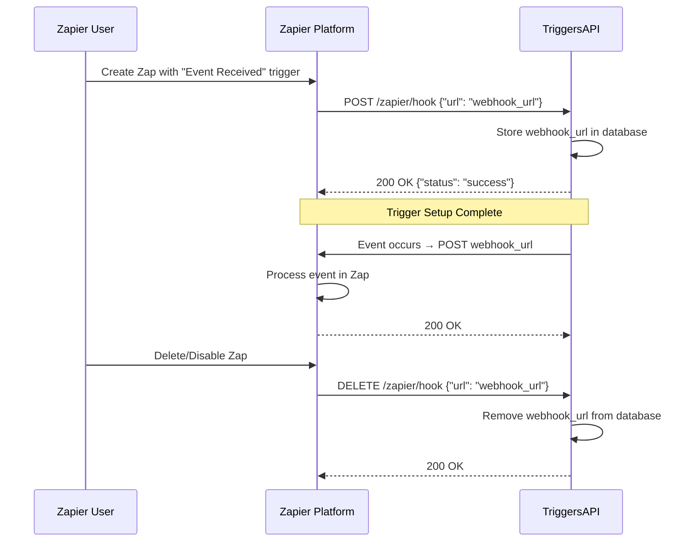

# Zapier App Setup Guide

**Version**: 1.0.0
**Last Updated**: 2025-11-12
**Status**: Private App (Draft)

## Table of Contents

1. [Overview](#overview)
2. [Prerequisites](#prerequisites)
3. [Setup Methods](#setup-methods)
4. [Method 1: Zapier Platform UI (Recommended)](#method-1-zapier-platform-ui-recommended)
5. [Method 2: Zapier Platform CLI (Advanced)](#method-2-zapier-platform-cli-advanced)
6. [REST Hook Trigger Configuration](#rest-hook-trigger-configuration)
7. [Testing Your Zapier App](#testing-your-zapier-app)
8. [Troubleshooting](#troubleshooting)
9. [Next Steps](#next-steps)

---

## Overview

This guide walks you through creating a private Zapier app for TriggersAPI that uses **REST Hooks** to deliver events to Zapier workflows. REST Hooks are Zapier's recommended approach for real-time event delivery, providing instant notifications when events occur in your TriggersAPI instance.

### What You'll Build

- **App Name**: TriggersAPI (or "Triggers")
- **Trigger Type**: REST Hook
- **Trigger Key**: `event`
- **Trigger Label**: "Event Received"
- **Authentication**: API Key (Bearer Token)
- **Version**: 1.0.0 (Draft/Private)

### Architecture Overview

```
┌──────────────┐         ┌──────────────┐         ┌──────────────┐
│   Zapier     │  Setup  │  TriggersAPI │ Events  │    Zapier    │
│  Platform    │────────▶│   Backend    │────────▶│  Webhooks    │
│              │◀────────│  /zapier/hook│         │              │
└──────────────┘   Test  └──────────────┘         └──────────────┘
```

---

## Prerequisites

### Required Accounts

1. **Zapier Account** (Free or Paid)
   - Sign up at: https://zapier.com/sign-up
   - Verify your email address
   - Access Zapier Platform: https://platform.zapier.com

2. **TriggersAPI Instance** (Local or Deployed)
   - Running instance with public URL (for Zapier to reach)
   - For local development: Use [ngrok](https://ngrok.com) or [Cloudflare Tunnel](https://developers.cloudflare.com/cloudflare-one/connections/connect-networks/)
   - For production: Deployed Cloudflare Worker URL

### Technical Requirements

- **Public HTTPS Endpoint**: Zapier requires HTTPS for webhook URLs
- **Bearer Token Authentication**: API key for securing webhook endpoints
- **Webhook Storage**: Database to store Zapier webhook subscription URLs
- **Webhook Delivery Logic**: Ability to POST events to registered webhooks

### Local Development Setup (Optional)

If testing locally, expose your local server via ngrok:

```bash
# Install ngrok
brew install ngrok  # macOS
# or download from https://ngrok.com/download

# Start TriggersAPI locally
npm run dev

# In another terminal, expose port 8787
ngrok http 8787

# Copy the https://xxxxxx.ngrok-free.app URL
# This will be your {BASE_URL} for webhook configuration
```

---

## Setup Methods

### Comparison

| Feature | Platform UI | Platform CLI |
|---------|-------------|--------------|
| **Ease of Use** | ⭐⭐⭐⭐⭐ | ⭐⭐⭐ |
| **Speed** | Fast (15 min) | Moderate (30 min) |
| **Code Required** | No | Yes (JavaScript) |
| **Version Control** | Manual | Git-friendly |
| **Best For** | Quick setup, MVP | Advanced features, CI/CD |

**Recommendation**: Start with Platform UI for speed, migrate to CLI later if needed.

---

## Method 1: Zapier Platform UI (Recommended)

### Step 1: Create Your App

1. **Navigate to Zapier Platform**
   - Go to: https://platform.zapier.com
   - Click **"Start a Zapier Integration"** or **"Create"** → **"Create an App"**

   📸 **Screenshot Placeholder**: `zapier-create-app.png`

2. **Configure Basic Information**
   ```
   App Name: TriggersAPI
   Description: Real-time event notifications from TriggersAPI
   Category: Developer Tools
   Intended Audience: Private
   Role: Triggers (sends data to Zapier)
   ```

3. **Save and Continue**
   - Click **"Create App"**
   - You'll be redirected to the app dashboard

   📸 **Screenshot Placeholder**: `zapier-app-created.png`

### Step 2: Configure Authentication

1. **Add Authentication Method**
   - In left sidebar, click **"Authentication"**
   - Choose **"API Key"** authentication type

   📸 **Screenshot Placeholder**: `zapier-auth-type.png`

2. **Configure API Key Authentication**
   ```yaml
   Authentication Fields:
     - Key: api_key
     - Label: "API Key"
     - Type: String
     - Required: Yes
     - Help Text: "Enter your TriggersAPI Bearer token"

   Authentication Test:
     - Method: GET
     - URL: {{BASE_URL}}/inbox
     - Headers:
         Authorization: Bearer {{api_key}}
     - Expected Status: 200
   ```

3. **Connection Label**
   ```
   Template: {{api_key}}
   (Shows last 4 characters: "...abc123")
   ```

4. **Save Authentication Settings**

   📸 **Screenshot Placeholder**: `zapier-auth-configured.png`

### Step 3: Create REST Hook Trigger

1. **Add New Trigger**
   - In left sidebar, click **"Triggers"**
   - Click **"Create a Trigger"**

   📸 **Screenshot Placeholder**: `zapier-create-trigger.png`

2. **Configure Trigger Basics**
   ```yaml
   Trigger Settings:
     Key: event
     Name: Event Received
     Noun: Event
     Description: Triggers when a new event is received by TriggersAPI
     Important: Yes (makes it more prominent in Zapier editor)
   ```

3. **Set Trigger Type**
   - **Type**: Select **"REST Hook"**
   - REST Hooks are used for real-time data delivery

   📸 **Screenshot Placeholder**: `zapier-trigger-rest-hook.png`

4. **Configure REST Hook Endpoints**

   **Subscribe (Setup) Endpoint:**
   ```yaml
   Method: POST
   URL: {{BASE_URL}}/zapier/hook
   Body:
     {
       "url": "{{bundle.targetUrl}}"
     }
   Headers:
     Authorization: Bearer {{bundle.authData.api_key}}
     Content-Type: application/json
   ```

   **Unsubscribe (Teardown) Endpoint:**
   ```yaml
   Method: DELETE
   URL: {{BASE_URL}}/zapier/hook
   Body:
     {
       "url": "{{bundle.targetUrl}}"
     }
   Headers:
     Authorization: Bearer {{bundle.authData.api_key}}
     Content-Type: application/json
   ```

   **Test Poll (Get Sample) Endpoint:**
   ```yaml
   Method: GET
   URL: {{BASE_URL}}/zapier/hook/sample
   Headers:
     Authorization: Bearer {{bundle.authData.api_key}}
   ```

   📸 **Screenshot Placeholder**: `zapier-rest-hook-config.png`

5. **Define Output Fields**

   Add the following output fields that Zapier will receive:

   ```yaml
   Output Fields:
     - Key: id
       Label: Event ID
       Type: string
       Required: true

     - Key: event_id
       Label: Event ID (Alias)
       Type: string

     - Key: event_type
       Label: Event Type
       Type: string

     - Key: timestamp
       Label: Timestamp
       Type: string
       Help Text: ISO-8601 timestamp of when event occurred

     - Key: payload
       Label: Payload
       Type: object
       Help Text: Raw event payload data

     - Key: metadata
       Label: Metadata
       Type: object
       Help Text: Event metadata (correlation_id, source_ip, etc)

     - Key: created_at
       Label: Created At
       Type: string
       Help Text: ISO-8601 timestamp of when event was stored
   ```

   📸 **Screenshot Placeholder**: `zapier-output-fields.png`

6. **Configure Sample Data**

   Add sample data for testing:

   ```json
   {
     "id": "evt_12345abcde",
     "event_id": "evt_12345abcde",
     "event_type": "test_event",
     "timestamp": "2025-11-12T14:30:00.000Z",
     "payload": {
       "message": "Sample test event from TriggersAPI",
       "source": "zapier",
       "test": true
     },
     "metadata": {
       "correlation_id": "corr_abc123",
       "source_ip": "192.0.2.1",
       "user_agent": "Zapier/1.0"
     },
     "created_at": "2025-11-12T14:30:00.500Z"
   }
   ```

7. **Save Trigger Configuration**

   📸 **Screenshot Placeholder**: `zapier-trigger-saved.png`

### Step 4: Test Your Trigger

1. **Test Authentication**
   - Go to **"Authentication"** tab
   - Click **"Test Your Authentication"**
   - Enter a valid API key
   - Should receive 200 OK response

   📸 **Screenshot Placeholder**: `zapier-test-auth.png`

2. **Test Trigger Subscribe**
   - Go to **"Triggers"** → **"Event Received"**
   - Click **"Test Your Trigger"**
   - Zapier will attempt to POST to `/zapier/hook`
   - ⚠️ **Note**: This will fail until Story 8.2 implements the endpoint

3. **Expected Behavior (After Story 8.2)**
   - Subscribe: Returns `{ "status": "success", "url": "..." }`
   - Test Poll: Returns sample event array
   - Unsubscribe: Returns 200 OK status

### Step 5: Publish Draft Version

1. **Create Version**
   - Click **"Versions"** in left sidebar
   - Click **"Create Version"**
   - Version: `1.0.0`
   - Changelog: "Initial REST Hook trigger implementation"

   📸 **Screenshot Placeholder**: `zapier-create-version.png`

2. **Publish to Draft**
   - Click **"Make this version available"**
   - Status: **Draft** (not public)
   - Only you can use this version

   📸 **Screenshot Placeholder**: `zapier-publish-draft.png`

3. **Share with Collaborators (Optional)**
   - Go to **"Sharing"** tab
   - Add email addresses of team members
   - They can use the app without it being public

---

## Method 2: Zapier Platform CLI (Advanced)

### Step 1: Install Zapier CLI

```bash
# Install globally via npm
npm install -g zapier-platform-cli

# Verify installation
zapier --version
# Should output: zapier-platform-cli/16.x.x

# Authenticate with Zapier
zapier login
# Opens browser for OAuth authentication
```

### Step 2: Initialize App from Template

```bash
# Create new app from REST Hooks template
zapier init triggers-api --template=rest-hooks

# Navigate into directory
cd triggers-api

# Install dependencies
npm install
```

### Step 3: Configure App Manifest

Edit `package.json` to configure app metadata:

```json
{
  "name": "triggers-api",
  "version": "1.0.0",
  "description": "Real-time event notifications from TriggersAPI",
  "main": "index.js",
  "zapier": {
    "title": "TriggersAPI",
    "description": "Real-time event notifications from TriggersAPI",
    "category": "Developer Tools",
    "platformVersion": "16.0.0"
  }
}
```

### Step 4: Configure REST Hook Trigger

Edit `triggers/event.js`:

```javascript
const subscribeHook = async (z, bundle) => {
  const response = await z.request({
    method: 'POST',
    url: `${bundle.authData.base_url}/zapier/hook`,
    headers: {
      'Authorization': `Bearer ${bundle.authData.api_key}`,
      'Content-Type': 'application/json',
    },
    body: {
      url: bundle.targetUrl,
    },
  });

  return response.data;
};

const unsubscribeHook = async (z, bundle) => {
  const response = await z.request({
    method: 'DELETE',
    url: `${bundle.authData.base_url}/zapier/hook`,
    headers: {
      'Authorization': `Bearer ${bundle.authData.api_key}`,
      'Content-Type': 'application/json',
    },
    body: {
      url: bundle.targetUrl,
    },
  });

  return response.data;
};

const getRecentEvents = async (z, bundle) => {
  const response = await z.request({
    method: 'GET',
    url: `${bundle.authData.base_url}/zapier/hook/sample`,
    headers: {
      'Authorization': `Bearer ${bundle.authData.api_key}`,
    },
  });

  return response.data;
};

module.exports = {
  key: 'event',
  noun: 'Event',
  display: {
    label: 'Event Received',
    description: 'Triggers when a new event is received by TriggersAPI',
    important: true,
  },
  operation: {
    type: 'hook',
    performSubscribe: subscribeHook,
    performUnsubscribe: unsubscribeHook,
    perform: getRecentEvents,
    performList: getRecentEvents,
    sample: {
      id: 'evt_12345abcde',
      event_id: 'evt_12345abcde',
      event_type: 'test_event',
      timestamp: '2025-11-12T14:30:00.000Z',
      payload: {
        message: 'Sample test event from TriggersAPI',
        source: 'zapier',
        test: true,
      },
      metadata: {
        correlation_id: 'corr_abc123',
        source_ip: '192.0.2.1',
        user_agent: 'Zapier/1.0',
      },
      created_at: '2025-11-12T14:30:00.500Z',
    },
    outputFields: [
      { key: 'id', label: 'Event ID', type: 'string', required: true },
      { key: 'event_id', label: 'Event ID (Alias)', type: 'string' },
      { key: 'event_type', label: 'Event Type', type: 'string' },
      { key: 'timestamp', label: 'Timestamp', type: 'string' },
      { key: 'payload', label: 'Payload', type: 'object' },
      { key: 'metadata', label: 'Metadata', type: 'object' },
      { key: 'created_at', label: 'Created At', type: 'string' },
    ],
  },
};
```

### Step 5: Test Locally

```bash
# Test authentication
zapier test

# Start local dev server
zapier dev

# In another terminal, create test webhook
curl -X POST http://localhost:3000/zapier/hook \
  -H "Content-Type: application/json" \
  -d '{"url": "https://hooks.zapier.com/test/123"}'
```

### Step 6: Deploy to Zapier

```bash
# Push to Zapier platform
zapier push

# Make version available
zapier promote 1.0.0
```

---

## REST Hook Trigger Configuration

### Complete Configuration Reference

See [`zapier-trigger-config.yaml`](./zapier-trigger-config.yaml) for the complete YAML configuration.

### Webhook Lifecycle



### Endpoint Specifications

#### 1. Subscribe Endpoint (Setup)

**Purpose**: Register a new webhook subscription

```http
POST /zapier/hook
Authorization: Bearer {api_key}
Content-Type: application/json

{
  "url": "https://hooks.zapier.com/hooks/catch/123456/abcdef/"
}
```

**Expected Response:**

```json
{
  "status": "success",
  "url": "https://hooks.zapier.com/hooks/catch/123456/abcdef/",
  "created_at": "2025-11-12T14:30:00.000Z"
}
```

#### 2. Test Poll Endpoint (Get Sample)

**Purpose**: Return sample event for Zapier testing

```http
GET /zapier/hook/sample
Authorization: Bearer {api_key}
```

**Expected Response:**

```json
[
  {
    "id": "evt_12345abcde",
    "event_id": "evt_12345abcde",
    "event_type": "test_event",
    "timestamp": "2025-11-12T14:30:00.000Z",
    "payload": {
      "message": "Sample test event",
      "source": "zapier"
    },
    "metadata": {
      "correlation_id": "corr_abc123"
    },
    "created_at": "2025-11-12T14:30:00.500Z"
  }
]
```

#### 3. Unsubscribe Endpoint (Teardown)

**Purpose**: Remove webhook subscription

```http
DELETE /zapier/hook
Authorization: Bearer {api_key}
Content-Type: application/json

{
  "url": "https://hooks.zapier.com/hooks/catch/123456/abcdef/"
}
```

**Expected Response:**

```json
{
  "status": "deleted",
  "url": "https://hooks.zapier.com/hooks/catch/123456/abcdef/"
}
```

#### 4. Event Delivery (Webhook Push)

**Purpose**: Send events to subscribed webhooks

```http
POST https://hooks.zapier.com/hooks/catch/123456/abcdef/
Content-Type: application/json

{
  "id": "evt_67890xyz",
  "event_id": "evt_67890xyz",
  "event_type": "user.signup",
  "timestamp": "2025-11-12T15:45:00.000Z",
  "payload": {
    "user_id": "user_123",
    "email": "user@example.com",
    "plan": "pro"
  },
  "metadata": {
    "correlation_id": "corr_xyz789",
    "source_ip": "203.0.113.45"
  },
  "created_at": "2025-11-12T15:45:00.250Z"
}
```

**Expected Zapier Response:**

```json
{
  "status": "success"
}
```

---

## Testing Your Zapier App

### Phase 1: Authentication Testing

1. **Test API Key Connection**
   ```bash
   # From Zapier Platform UI
   # Go to "Authentication" → "Test Your Authentication"
   # Enter API key → Click "Test"

   # Expected: Green checkmark with "Connection successful"
   ```

2. **Verify Token in TriggersAPI**
   ```bash
   # Check if token is valid
   curl -X GET http://localhost:8787/inbox \
     -H "Authorization: Bearer YOUR_API_KEY"

   # Expected: 200 OK with event list
   ```

### Phase 2: Trigger Testing (After Story 8.2)

1. **Test Subscribe Hook**
   ```bash
   # Simulate Zapier subscribe request
   curl -X POST http://localhost:8787/zapier/hook \
     -H "Authorization: Bearer YOUR_API_KEY" \
     -H "Content-Type: application/json" \
     -d '{"url": "https://webhook.site/unique-id"}'

   # Expected: {"status": "success", "url": "..."}
   ```

2. **Test Sample Data Retrieval**
   ```bash
   curl -X GET http://localhost:8787/zapier/hook/sample \
     -H "Authorization: Bearer YOUR_API_KEY"

   # Expected: Array with sample event
   ```

3. **Test Event Delivery**
   ```bash
   # Send event to TriggersAPI
   curl -X POST http://localhost:8787/events \
     -H "Authorization: Bearer YOUR_API_KEY" \
     -H "Content-Type: application/json" \
     -d '{
       "payload": {
         "event_type": "test.webhook",
         "message": "Testing Zapier delivery"
       }
     }'

   # Check webhook.site to see if event was delivered
   ```

4. **Test Unsubscribe Hook**
   ```bash
   curl -X DELETE http://localhost:8787/zapier/hook \
     -H "Authorization: Bearer YOUR_API_KEY" \
     -H "Content-Type: application/json" \
     -d '{"url": "https://webhook.site/unique-id"}'

   # Expected: {"status": "deleted"}
   ```

### Phase 3: End-to-End Zap Testing

1. **Create Test Zap**
   - Trigger: TriggersAPI → Event Received
   - Action: Slack → Send Channel Message (or any test action)

2. **Configure Trigger**
   - Connect TriggersAPI account (enter API key)
   - Click "Test trigger"
   - Should show sample event data

3. **Test Zap**
   - Turn Zap on
   - Send test event to `/events` endpoint
   - Verify Slack (or test action) receives event
   - Check Zap History for successful run

4. **Verify Webhook Storage**
   ```bash
   # Query D1 database for stored webhooks
   npx wrangler d1 execute triggers-api --local \
     --command "SELECT * FROM zapier_webhooks"

   # Should show registered webhook URL
   ```

---

## Troubleshooting

### Common Issues

#### 1. "Connection Failed" During Authentication Test

**Problem**: Zapier cannot reach your API endpoint

**Solutions**:
- Verify your BASE_URL is publicly accessible (not localhost)
- Use ngrok or Cloudflare Tunnel for local testing
- Check firewall rules allow inbound HTTPS traffic
- Verify Bearer token is valid in AUTH_KV namespace

#### 2. "Subscribe Hook Failed"

**Problem**: `/zapier/hook` endpoint returns error

**Solutions**:
- Ensure Story 8.2 backend implementation is complete
- Verify database schema includes `zapier_webhooks` table
- Check Bearer token has write permissions
- Inspect Worker logs: `npx wrangler tail`

#### 3. "No Sample Data Available"

**Problem**: Test poll endpoint returns empty array

**Solutions**:
- Implement `/zapier/hook/sample` endpoint (Story 8.2)
- Return hardcoded sample event matching schema
- Verify response is array, not single object

#### 4. "Events Not Delivered to Zapier"

**Problem**: Events hit `/events` but don't reach Zapier webhook

**Solutions**:
- Verify webhook URL is stored in database
- Check event delivery logic in queue consumer (Story 8.3)
- Inspect Zapier webhook URL logs (webhook.site for testing)
- Verify CORS headers allow POST to Zapier domains
- Check retry logic for failed deliveries

#### 5. "Zapier Shows 'Trigger Not Configured'"

**Problem**: REST Hook trigger missing required configuration

**Solutions**:
- Verify all three endpoints configured (subscribe/unsubscribe/poll)
- Check output fields are defined
- Ensure sample data matches output schema
- Re-save trigger configuration

### Debug Checklist

- [ ] BASE_URL is publicly accessible HTTPS endpoint
- [ ] API key authentication works via `/inbox` test
- [ ] `/zapier/hook` POST returns success response
- [ ] `/zapier/hook/sample` GET returns sample event array
- [ ] `/zapier/hook` DELETE returns success response
- [ ] Sample data includes all output fields
- [ ] Zapier app version is published to Draft status
- [ ] Test Zap can subscribe to trigger

---

## Next Steps

### Immediate Next Steps (Story 8.2)

1. **Implement Backend Endpoints**
   - Create `/zapier/hook` route in TriggersAPI
   - Handle POST (subscribe), GET (sample), DELETE (unsubscribe)
   - Store webhooks in D1 database

2. **Create Database Schema**
   ```sql
   CREATE TABLE zapier_webhooks (
     id TEXT PRIMARY KEY,
     webhook_url TEXT NOT NULL UNIQUE,
     api_key TEXT NOT NULL,
     created_at TEXT NOT NULL,
     last_delivered_at TEXT
   );
   ```

3. **Test Webhook Registration**
   - Use Zapier UI to create test Zap
   - Verify subscription creates database entry
   - Check unsubscribe removes entry

### Future Stories

- **Story 8.3**: Webhook delivery logic (POST events to registered webhooks)
- **Story 8.4**: Security (signature verification, rate limiting)
- **Story 8.5**: Monitoring (delivery metrics, failed webhook tracking)
- **Story 8.6**: Public app submission (optional)

---

## Resources

### Official Documentation

- [Zapier Platform Documentation](https://platform.zapier.com/docs)
- [REST Hooks Guide](https://platform.zapier.com/build/rest-hooks)
- [Authentication Docs](https://platform.zapier.com/build/auth)
- [Testing Best Practices](https://platform.zapier.com/build/test)

### TriggersAPI Documentation

- [API Reference](./API.md)
- [Architecture Overview](./ARCHITECTURE_OVERVIEW.md)
- [Deployment Guide](./DEPLOYMENT.md)

### Tools

- [ngrok](https://ngrok.com) - Expose local server publicly
- [webhook.site](https://webhook.site) - Test webhook deliveries
- [Zapier Platform UI](https://platform.zapier.com)
- [Zapier Platform CLI](https://github.com/zapier/zapier-platform)

---

## Appendix

### A. Environment Variables

Add to `.env` or Cloudflare Workers secrets:

```bash
# Zapier Configuration
ZAPIER_ENABLED=true
ZAPIER_WEBHOOK_TIMEOUT=5000  # 5 seconds
ZAPIER_MAX_RETRIES=3
ZAPIER_RETRY_BACKOFF=exponential
```

### B. Sample Event Payload

Complete example event that will be delivered to Zapier:

```json
{
  "id": "evt_2025111215450012345",
  "event_id": "evt_2025111215450012345",
  "event_type": "user.signup",
  "timestamp": "2025-11-12T15:45:00.123Z",
  "payload": {
    "user_id": "user_abc123",
    "email": "user@example.com",
    "name": "John Doe",
    "plan": "pro",
    "trial_end": "2025-12-12T15:45:00.000Z",
    "metadata": {
      "referral_code": "FRIEND10",
      "utm_source": "google",
      "utm_campaign": "summer_sale"
    }
  },
  "metadata": {
    "correlation_id": "corr_xyz789abc",
    "source_ip": "203.0.113.45",
    "user_agent": "Mozilla/5.0 (Windows NT 10.0; Win64; x64)",
    "request_id": "req_abcdef123456"
  },
  "created_at": "2025-11-12T15:45:00.456Z"
}
```

### C. Webhook Response Handling

Expected responses from Zapier webhooks:

**Success:**
```json
{
  "status": "success"
}
```

**Rate Limited (429):**
```json
{
  "status": "throttled",
  "retry_after": 60
}
```

**Error (4xx/5xx):**
- Implement exponential backoff retry
- After 3 failures, log to dead-letter queue
- Alert on sustained delivery failures

---

## Change Log

| Version | Date | Changes |
|---------|------|---------|
| 1.0.0 | 2025-11-12 | Initial Zapier app setup guide created |

---

**Questions or Issues?**

- Check [Troubleshooting](#troubleshooting) section
- Review [Zapier Platform Docs](https://platform.zapier.com/docs)
- Inspect Worker logs: `npx wrangler tail`
- Test endpoints with `curl` or Postman

---

*This guide is part of Story 8.1 - Zapier App Setup*
