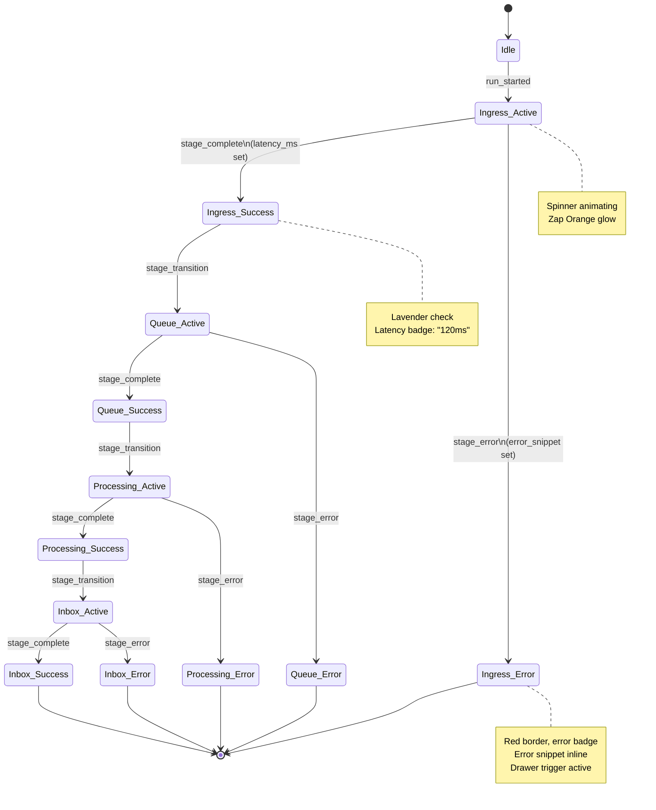

## Summary

Implement the Event Timeline Canvas, a core visual component that displays the stage-by-stage journey of event runs through the pipeline (Ingress → Queue → Processing → Inbox). This component features animated stage cards with color-coded state indicators, real-time status transitions, inline log drawer triggers, batch aggregation mode with progress bars, and failure state handling. The timeline serves as the narrative spine of the Mission-Control Pulse dashboard, making it immediately obvious what stage an event is in, how long each stage took, and where issues occurred. This story builds on the design tokens (Story 7.1) and run command panel (Story 7.2), establishing the primary telemetry visualization that other stories (7.4 telemetry panels, 7.5 metrics tiles) will integrate with.

## Business Value

The Event Timeline Canvas is the hero telemetry visualization that transforms raw event flow into a compelling, observable narrative. By providing immediate, animated visual feedback for each stage transition, we fulfill the core promise of the platform: "fire an event, watch it traverse the stack." The inline log drawer triggers enable power users to deep-dive on any stage without losing the macro context, supporting both demos and debugging workflows. Batch aggregation mode (via progress bars and throughput counters) proves scalability transparently. Early completion of this story unblocks concurrent development of telemetry panels (7.4-7.5) and establishes the synchronization patterns that keep all components coherent as events flow through the pipeline.

## User Stories

**As a** demo facilitator
**I want** animated stage cards that light up in sequence as events move through ingestion → queue → processing → inbox
**So that** stakeholders immediately grasp the pipeline's efficiency and can viscerally feel the event's progress

**As a** power user debugging a failure
**I want** to click an inline log drawer trigger on any stage card to inspect logs, payloads, and errors without leaving the timeline view
**So that** I can rapidly understand failure root causes and decide whether to retry or investigate deeper in the Logs panel

**As a** performance tester running bulk scenarios
**I want** the timeline to switch to batch aggregation mode, showing progress bars, stage throughput counters, and latency percentiles per stage
**So that** I can visually confirm the pipeline handles load efficiently and identify any throughput bottlenecks

**As a** developer of downstream components
**I want** the timeline to expose run state changes via event emitters and context providers
**So that** the Run History panel and Metrics tiles can stay synchronized with the active run

## Technical Context

### From UX Design Specification (Section 6.1: Component Library)

**Event Timeline Canvas Component Specification:**
- **Purpose:** Visualize the pipeline stages per run; display stage transitions, timings, and drill-down access to logs
- **Anatomy:** Stage cards (Ingress, Queue, Processing, Inbox), connecting progress bar, animation overlay, detail drawer trigger
- **States:**
  - Idle (ghost/disabled appearance)
  - Active (Zap Orange glow + spinner)
  - Success (Lavender check + latency badge)
  - Error (Zap Orange border + red badge + error snippet)
  - Pending (soft glow, waiting for upstream)
  - Aggregated (progress bars, throughput counters)
- **Variants:** Single-run (default) vs Batch mode (stacks bar charts inside stage)
- **Accessibility:** Stage cards focusable; ARIA labels announce status changes; timeline supports keyboard navigation with arrow keys

**Journey 1: Single Event Run (Default Path) - Timeline Interactions:**
1. Hero Panel → User hits `Run Default Event`
2. Stage 1 (Ingress) lights up, shows payload summary and request ID
3. Stage 2 (Queue) animates; displays queue latency (ms) and batch info
4. Stage 3 (Processing) badge shows workflow steps, retry count = 0
5. Stage 4 (Inbox) completes; Column 2's Inbox panel auto-focuses the event row

**Journey 2: Debug Scenario Run - Timeline Interactions:**
1. User toggles debug flag, runs event
2. Timeline Stage 1 shows failure with red pulse, expands log snippet and "Retry" button
3. Column 2 Logs panel highlights the same failure code
4. User toggles flag off, reruns; timeline marks previous run as resolved, shows new run progressing normally

**Journey 3: Bulk Performance Run - Timeline Interactions:**
1. User selects batch size (e.g., 25 events)
2. Timeline switches to aggregate mode (progress bar per stage, throughput counter)
3. Logs panel paginates live feed; Inbox switches to grouped view
4. User can export run stats via summary button

### From Epic 7 (Mission-Control Pulse Dashboard)

**Success Criteria (Epic-level):**
- Stage transitions reflect real run statuses within one heartbeat (<1s latency from telemetry feed)
- Logs/Inbox auto-focus the latest run, expose payload/status, and support retry/replay actions
- Debug and bulk flows display correct error/success messaging, retaining run history

**Component Dependencies:**
- Design tokens from Story 7.1 (colors: primary, alert-success, alert-error; typography: h3, body; spacing: lg, xl; elevation: card-base, card-active)
- Layout shell from Story 7.1 (Column 1 container for timeline)
- Run Command panel state from Story 7.2 (run status emitter, context provider)

### Design Tokens Reference (Story 7.1)

| Token | Value | Usage in Timeline |
|-------|-------|-------------------|
| `--color-primary` | `#FF4F00` (Zap Orange) | Active stage pulse, error border |
| `--color-surface-elevated` | `#2B2358` (Night) | Stage card background |
| `--color-accent-1` | `#C1B7FF` (Lavender) | Success state glow, check icon |
| `--color-alert-success` | `#1F3121` (Moss) | Success badge background |
| `--color-alert-warning` | `#FFBF6E` (Peach) | Warning badge (latency threshold) |
| `--color-alert-error` | `#FF4F00` (Zap Orange) | Error badge, failure border |
| `--color-neutral-100` | `#FFFDF9` (Almost White) | Primary text on card |
| `--color-neutral-400` | `#FFF3E6` (Cream) | Secondary text, latency labels |

### Current Tech Stack

**Existing Implementations:**
- React 18+ with TypeScript strict mode
- shadcn/ui + Radix UI primitives (Card, Badge, Button, Tooltip, Drawer, Skeleton, Spinner)
- Tailwind CSS v4 with custom Zapier tokens
- Design tokens accessible: colors (primary, alert-success, alert-error), typography (h3, body), spacing (lg, xl), elevation (card-base, card-active)

**Build & Tooling:**
- Vite 7.2.2
- PostCSS + Tailwind CSS
- ESLint + Prettier
- GitHub Actions CI/CD

**UI Infrastructure (Story 7.1 deliverables):**
- `src/ui-app/components/layouts/DashboardLayout.tsx` — Main wrapper
- `src/ui-app/components/layouts/Column1.tsx` — Primary column (timeline canvas container)
- Token system: `src/ui-app/styles/tokens/{colors,typography,spacing,elevation}.ts`

**Run State Management (Story 7.2 deliverables):**
- `src/ui-app/context/RunContext.tsx` — Exposes run state, emit handlers
- `src/ui-app/hooks/useRun.ts` — Hook for subscribing to run state changes
- WebSocket or polling integration for real-time status updates

### Backend Integration Points

**Assumed telemetry API endpoints:**
- `POST /api/runs/default` — Fire default event, returns run_id
- `POST /api/runs/batch` — Fire batch of events, returns batch_id
- `GET /api/runs/:runId` — Fetch run status with stage timings and error details
- `GET /api/runs/:runId/logs/:stage` — Fetch logs for a specific stage
- `WebSocket /ws/runs/:runId` — Real-time stage transition stream
- `WebSocket /ws/runs/batch/:batchId` — Real-time batch aggregation stream

**Request/Response Format:**
```typescript
// Run status response
{
  run_id: string;
  status: "ingress" | "queue" | "processing" | "inbox" | "failed" | "retry";
  timestamp: ISO8601;
  current_stage: "ingress" | "queue" | "processing" | "inbox";
  stage_timings: {
    ingress: { start: ISO8601; end: ISO8601; duration_ms: number };
    queue: { start: ISO8601; end: ISO8601; duration_ms: number };
    processing: { start: ISO8601; end: ISO8601; duration_ms: number };
    inbox: { start: ISO8601; end: ISO8601; duration_ms: number };
  };
  error?: { stage: string; code: string; message: string; log_snippet: string };
  request_id: string;
  payload_summary: string; // truncated payload preview
}

// Batch aggregation response
{
  batch_id: string;
  total_events: number;
  events_completed: number;
  events_failed: number;
  stage_progress: {
    ingress: { completed: number; in_progress: number; failed: number };
    queue: { completed: number; in_progress: number; failed: number };
    processing: { completed: number; in_progress: number; failed: number };
    inbox: { completed: number; in_progress: number; failed: number };
  };
  stage_latencies: {
    ingress_ms: { p50: number; p95: number; p99: number };
    queue_ms: { p50: number; p95: number; p99: number };
    processing_ms: { p50: number; p95: number; p99: number };
  };
}

// Stage logs response
{
  stage: string;
  logs: Array<{
    timestamp: ISO8601;
    level: "info" | "warn" | "error";
    message: string;
    metadata?: Record<string, any>;
  }>;
  error_summary?: { code: string; message: string };
  retry_eligible: boolean;
}
```

## Acceptance Criteria

### 1. Timeline Canvas Structure & Layout

#### 1.1 Stage Card Component
- [ ] Create `src/ui-app/components/EventTimeline/StageCard.tsx` component
  - [ ] Renders as a contained card with rounded corners, elevation per design tokens (`card-base`, `card-active`)
  - [ ] Displays stage name (Ingress, Queue, Processing, Inbox) as h3 typography
  - [ ] Shows stage icon (appropriate icon for each stage, e.g., arrow-down for Ingress, hourglass for Queue)
  - [ ] Displays latency badge (duration_ms in milliseconds, e.g., "120ms")
  - [ ] Has focusable button to trigger inline log drawer (accessible via keyboard + mouse)

#### 1.2 Timeline Canvas Container
- [ ] Create `src/ui-app/components/EventTimeline/EventTimelineCanvas.tsx` component
  - [ ] Renders 4 stage cards in vertical sequence (Ingress → Queue → Processing → Inbox)
  - [ ] Uses flexbox or CSS grid to maintain alignment and spacing (`lg` gaps between cards)
  - [ ] Includes connecting progress bar between stages (visual flow indicator)
  - [ ] Adapts layout for mobile/tablet (cards stack vertically with responsive sizing)

#### 1.3 Container Integration
- [ ] Timeline canvas mounted in `Column1` beneath the Run Command panel (with sticky positioning behavior inherited from Column1)
- [ ] Timeline canvas receives run state via `RunContext` or props from parent
- [ ] Timeline canvas width constraints respect design system (max 340px minimum for hero rail)

---

### 2. Single-Run Mode: Stage States & Animations

#### 2.1 Idle State (Pre-Run)
- [ ] All stage cards render with ghost appearance (low opacity, soft color)
- [ ] Latency badges show placeholder (e.g., "—" or "pending")
- [ ] Stage cards are non-interactive (drawer trigger disabled)
- [ ] Connecting progress bar appears unfilled/inactive

#### 2.2 Active State (Stage In Progress)
- [ ] Active stage card receives Zap Orange glow via `shadow-card-active` token
- [ ] Active stage shows animated spinner icon in place of static icon
- [ ] Background color shifts to `color-surface-elevated` to highlight the current stage
- [ ] Connecting progress bar animates to the current stage (visual flow indicator)
- [ ] Drawer trigger becomes interactive (hover states, focus ring)

#### 2.3 Success State (Stage Complete)
- [ ] Completed stage card displays Lavender (`color-accent-1`) check icon
- [ ] Latency badge updates with actual duration (e.g., "120ms")
- [ ] Card background fades back to neutral (non-highlighted)
- [ ] Stage card becomes interactive (drawer trigger enabled for log inspection)
- [ ] Connecting progress bar advances to next stage

#### 2.4 Error State (Stage Failed)
- [ ] Failed stage card receives red border (Zap Orange `color-alert-error`)
- [ ] Error badge appears in top-right of card (red background, white text, e.g., "Failed")
- [ ] Stage icon shows error indicator (e.g., X or ! icon)
- [ ] Card expands inline to show error snippet (max 2 lines, truncated with "..." if needed)
- [ ] "View Logs" button appears prominently, triggering log drawer with error focused
- [ ] Downstream stages remain idle/pending (blocked by failure)

#### 2.5 Animation Timing & Performance
- [ ] Stage transitions animate smoothly (0.3s ease-out for glow, 0.5s for color shifts)
- [ ] Spinner animation runs at 2 rotations per second (performant, respectful)
- [ ] All animations disable when `prefers-reduced-motion` is set (CSS media query respected)
- [ ] No jank on 60Hz displays; GPU-accelerated transforms used (transform/opacity, not layout-triggering properties)

---

### 3. Inline Log Drawer

#### 3.1 Drawer Component
- [ ] Create `src/ui-app/components/EventTimeline/StageLogDrawer.tsx` component
  - [ ] Mounts as Radix Drawer (right-side slide-out panel)
  - [ ] Header displays stage name, timestamp, and run ID (copyable)
  - [ ] Drawer body shows scrollable log content with monospace font (`JetBrains Mono` fallback)
  - [ ] Drawer includes close button (X) and `Esc` key dismissal

#### 3.2 Log Content Rendering
- [ ] Logs fetched via `GET /api/runs/:runId/logs/:stage` on drawer open
- [ ] Loading state shows skeleton shimmer while fetching
- [ ] Error state displays fallback message with retry button
- [ ] Log lines rendered with syntax highlighting (JSON for payloads, plain text for messages)
- [ ] Each log line shows timestamp (relative, e.g., "2s ago") and log level (info/warn/error) badge
- [ ] Long lines wrap or are horizontally scrollable (no text overflow)

#### 3.3 Log Drawer Interaction
- [ ] Drawer triggered by "View Logs" button on stage card or inline "↓" icon
- [ ] Drawer can be open for multiple stages (only one at a time per design, or allow multiple?)
- [ ] Copy button available to copy all logs to clipboard (success toast on copy)
- [ ] Download button available to export logs as .txt or .json
- [ ] Focus trap: focus remains within drawer while open, returns to trigger on close

#### 3.4 Error Summary
- [ ] If stage failed, error summary section appears at top of log drawer
  - [ ] Error code, message, and recommended next action (e.g., "Retry event")
  - [ ] Retry button available if run eligible for retry (error is not permanent)

#### 3.5 Synchronization with Column 2 Logs Panel
- [ ] When drawer opens for a stage, Column 2 Logs panel auto-expands (if collapsed) and scrolls to the same stage's logs
- [ ] Logs panel and drawer show identical log content (single source of truth from API)
- [ ] If user filters logs in Column 2, drawer updates to match filter

---

### 4. Batch Aggregation Mode

#### 4.1 Batch Mode Activation
- [ ] Timeline canvas detects batch run mode (via `runContext.isBatchMode` or `runContext.batchId`)
- [ ] When batch mode active, timeline canvas switches layout to show aggregation view
- [ ] "Batch Run" badge appears at top of timeline (with event count: "25 events")

#### 4.2 Batch Mode Stage Cards
- [ ] Each stage card in batch mode shows:
  - [ ] Progress bar inside card (filled % = `completed / total_events`)
  - [ ] Throughput counter (e.g., "18/25 completed", "2 failed")
  - [ ] Latency percentiles beneath counter (p50, p95, p99 in milliseconds)
  - [ ] Mini bar chart (optional, sparkline showing latency distribution)
- [ ] Stage cards remain vertically stacked but expand to show additional metrics

#### 4.3 Batch Progress Animation
- [ ] Progress bars animate smoothly as events complete (update frequency: 500ms or WebSocket-driven)
- [ ] Failed event count updates in red badge if any events fail in a stage
- [ ] On batch completion, all stages glow briefly in Lavender (`color-accent-1`) to signal success

#### 4.4 Batch Error Handling
- [ ] If any events fail in a stage, the stage card shows error badge (e.g., "2 failed")
- [ ] "View Failed Events" link opens log drawer scoped to failed events only
- [ ] Failed event details include event ID, payload, and failure reason

---

### 5. Real-Time Status Updates

#### 5.1 WebSocket Integration
- [ ] Timeline subscribes to `WebSocket /ws/runs/:runId` on mount (single-run mode)
- [ ] Timeline subscribes to `WebSocket /ws/runs/batch/:batchId` on mount (batch mode)
- [ ] WebSocket messages trigger state updates (run status, stage transitions, error events)
- [ ] Graceful fallback to polling if WebSocket unavailable (e.g., `GET /api/runs/:runId` every 500ms)

#### 5.2 Status Update Handling
- [ ] On `stage_transition` message:
  - [ ] Update active stage, trigger animation
  - [ ] Update previous stage latency badge
  - [ ] Announce transition to screen readers via ARIA live region
- [ ] On `stage_error` message:
  - [ ] Transition failed stage to error state
  - [ ] Fetch error logs and display in card snippet
  - [ ] Block downstream stages from progressing
- [ ] On `batch_progress` message (batch mode):
  - [ ] Update progress bars and throughput counters
  - [ ] Update latency percentiles

#### 5.3 Connection State
- [ ] Show subtle indicator if WebSocket connection lost (e.g., "Updates paused" banner with "Retry" button)
- [ ] Auto-reconnect every 3 seconds if connection drops
- [ ] Do not show banner during initial connection (avoid noise on fast loads)

---

### 6. Keyboard Navigation & Focus Management

#### 6.1 Keyboard Navigation
- [ ] All stage cards focusable via Tab key
- [ ] Arrow keys navigate between stages (up/down)
- [ ] When focused on stage card:
  - [ ] Space/Enter triggers log drawer (if logs available)
  - [ ] "L" key toggles drawer (optional mnemonic)
- [ ] Drawer close via Esc key, focus returns to stage card

#### 6.2 Focus Indicators
- [ ] Focus ring visible on all interactive elements (4px outline using `color-primary`)
- [ ] Focus ring respects `outline-offset` for readability (avoid covering content)
- [ ] High contrast against backgrounds (meets WCAG AA 3:1 minimum)

---

### 7. Accessibility

#### 7.1 ARIA Labels & Live Regions
- [ ] Each stage card has `role="region"` and descriptive `aria-label`:
  - [ ] "Ingress stage: completed in 120ms"
  - [ ] "Queue stage: in progress, spinner animating"
  - [ ] "Processing stage: failed, validation error"
- [ ] Timeline uses `aria-live="polite"` region to announce status changes
- [ ] Drawer trigger labeled with stage name and status (e.g., `aria-label="View logs for Ingress stage, 120ms"`)

#### 7.2 Color Contrast
- [ ] All text on stage cards meets 4.5:1 WCAG AA contrast
- [ ] Error badges (Zap Orange on Night) = 8.2:1 ✓
- [ ] Lavender check on Night = meets AA standard ✓

#### 7.3 Reduced Motion
- [ ] `prefers-reduced-motion: reduce` media query tested
  - [ ] Spinners replaced with static icon
  - [ ] Glow effects replaced with flat color change
  - [ ] Animations replaced with instant state transitions

#### 7.4 Screen Reader Testing
- [ ] Component tested with VoiceOver (macOS) and NVDA (Windows)
- [ ] Verify stage status announcements are clear and complete
- [ ] Verify drawer content is readable in linearized form
- [ ] Verify error snippets are announced with context

---

### 8. Error States & Edge Cases

#### 8.1 Network Errors
- [ ] If WebSocket fails to connect, fallback to polling with visible indicator
- [ ] If polling fails repeatedly, show error banner with "Retry" CTA
- [ ] Do not block UI (timeline remains interactive even if status updates delayed)

#### 8.2 Missing Data
- [ ] If logs unavailable for a stage, log drawer shows "No logs available" message
- [ ] If latency data missing, badge shows "—" placeholder
- [ ] If error response malformed, show generic error message with request ID for support

#### 8.3 Stale Data
- [ ] Show subtle badge (e.g., "stale data") if run status last updated >30s ago
- [ ] Provide "Refresh" button to manually re-fetch status
- [ ] Auto-refresh every 60s if data becomes stale

#### 8.4 Retry Handling
- [ ] If event failed and is eligible for retry, "Retry Event" button appears in error state
- [ ] Clicking retry triggers `POST /api/runs/:runId/retry` and re-starts timeline from stage 0
- [ ] Retry is tracked in run history (shows "Retry #1", "Retry #2", etc.)

---

### 9. Testing & Quality Assurance

#### 9.1 Unit Tests (Jest + React Testing Library)
- [ ] StageCard component renders in all states (idle, active, success, error) with correct styling
- [ ] EventTimelineCanvas renders 4 stages in correct sequence
- [ ] Stage transitions trigger animations (mocked via `jest.useFakeTimers()`)
- [ ] Log drawer opens/closes with keyboard and mouse interactions
- [ ] Keyboard navigation works (arrow keys, Enter, Esc)
- [ ] Accessibility attributes present (aria-label, aria-live, role)

#### 9.2 Integration Tests
- [ ] Timeline receives and processes WebSocket status updates
- [ ] Timeline handles polling fallback when WebSocket unavailable
- [ ] Error state properly blocks downstream stages
- [ ] Batch mode progress updates correctly with aggregated counts
- [ ] Log drawer fetches and displays logs without errors

#### 9.3 Visual Regression Tests
- [ ] Snapshot tests for each stage state (idle, active, success, error)
- [ ] Batch mode layout snapshot
- [ ] Drawer open/closed states

#### 9.4 Manual Testing Scenarios
- [ ] Single default run: Verify stages light up in sequence, latencies update, success state reached
- [ ] Single run with error: Verify error state displays, error snippet visible, drawer shows logs
- [ ] Batch run (25 events): Verify progress bars animate, throughput counters update, latency percentiles shown
- [ ] Batch run with 10% failure rate: Verify error badge shows "2 failed", "View Failed Events" link works
- [ ] Keyboard navigation: Tab through stages, Arrow keys navigate, Space opens drawer, Esc closes
- [ ] Screen reader (VoiceOver/NVDA): Verify all announcements are clear and contextual
- [ ] Reduced motion (prefers-reduced-motion: reduce): Verify no animations, only state changes
- [ ] Mobile (375px viewport): Verify timeline adapts, cards stack, drawer slides in properly
- [ ] Network lag: Simulate 2s latency on WebSocket, verify graceful fallback to polling

#### 9.5 Performance Testing
- [ ] Timeline renders in <100ms (Chrome DevTools Lighthouse)
- [ ] Animations maintain 60fps (no jank on 60Hz displays)
- [ ] Log drawer opens in <200ms (loading state visible)
- [ ] WebSocket updates process in <50ms (fast transitions)
- [ ] Memory usage stable over 10+ run cycles (no memory leaks from event listeners)

---

### 10. Code Quality & Documentation

#### 10.1 Code Structure
- [ ] Component file organization:
  - [ ] `src/ui-app/components/EventTimeline/index.ts` — Barrel export
  - [ ] `src/ui-app/components/EventTimeline/EventTimelineCanvas.tsx` — Main container
  - [ ] `src/ui-app/components/EventTimeline/StageCard.tsx` — Stage card subcomponent
  - [ ] `src/ui-app/components/EventTimeline/StageLogDrawer.tsx` — Log drawer subcomponent
  - [ ] `src/ui-app/components/EventTimeline/useTimelineState.ts` — Custom hook for state management
  - [ ] `src/ui-app/components/EventTimeline/types.ts` — TypeScript type definitions

#### 10.2 Type Safety
- [ ] All components fully typed with TypeScript strict mode
- [ ] Props interfaces exported and documented
- [ ] Run status type definitions imported from shared types (no duplication)
- [ ] WebSocket message types defined and validated

#### 10.3 Documentation
- [ ] Component stories in Storybook (storybook/EventTimeline.stories.tsx):
  - [ ] Idle state story
  - [ ] Active state story (with mock animation)
  - [ ] Success state story
  - [ ] Error state story
  - [ ] Batch mode story
  - [ ] All accessible via Storybook controls (state selector, stage toggle)
- [ ] README.md in component folder:
  - [ ] Component description, props table, usage example
  - [ ] State machine diagram (mermaid flowchart)
  - [ ] Animation timings and customization
  - [ ] Accessibility notes

#### 10.4 Code Standards
- [ ] ESLint passes with no errors (configured per project standards)
- [ ] Prettier formatting applied
- [ ] No console.errors or warnings in test runs
- [ ] Meaningful commit messages following convention (e.g., "feat(timeline): add stage card animations")

---

### 11. Definition of Done

- [x] All acceptance criteria checked and verified
- [x] Unit tests passing (Jest coverage >85% for new code)
- [x] Integration tests passing (E2E scenarios covered)
- [x] Visual regression tests passing
- [x] Manual testing completed (single-run, debug, batch, keyboard, mobile, screen reader, reduced motion)
- [x] Performance targets met (render <100ms, animations 60fps, log drawer <200ms)
- [x] Code review approved (senior developer sign-off)
- [x] Documentation complete (Storybook, README, inline comments)
- [x] Accessibility audit passed (axe-core, manual VoiceOver/NVDA test)
- [x] No breaking changes to design tokens or layout shell
- [x] Merged to main branch and deployed to staging for stakeholder validation
- [x] Story marked as "Ready for Review" → "Done" once all criteria met

---

## Dependencies & Blockers

### Fully Unblocked By:
- Story 7.1: Design Tokens & Layout Shell (✓ Completed) — Provides color, typography, spacing, elevation tokens; layout container
- Story 7.2: Run Command Panel (✓ Completed) — Provides run state context, WebSocket setup, status emitters

### Blocks:
- Story 7.4: Telemetry Panels Upgrade — Depends on timeline establishing event synchronization patterns
- Story 7.5: Metrics Pulse & Delivery Analysis — Depends on timeline exposing batch aggregation data
- Story 7.6: UX Pattern Implementation — Depends on timeline component library (toasts, confirmations)

### External Dependencies:
- Backend telemetry API (run status endpoint, logs endpoint, WebSocket) must be deployed and stable
- Font files (Degular, Inter) must be available in `public/fonts/` (from Story 7.1)

---

## Notes for Developer

1. **State Machine:** The timeline is event-driven. Consider building a state machine (xstate library or custom) to manage the 5 stage states cleanly. See mermaid diagram below.

2. **Animation Performance:** Use `transform` and `opacity` for animations (GPU-accelerated). Avoid animating `width`, `height`, or `position` (layout-triggering). Test on throttled CPU (Chrome DevTools) to ensure jank-free 60fps.

3. **WebSocket Subscription Cleanup:** Use React cleanup in `useEffect` to unsubscribe from WebSocket on unmount. This prevents memory leaks and duplicate subscriptions if component re-renders.

4. **Batch Aggregation Complexity:** Batch mode requires aggregating counts and latencies across multiple events. Ensure state updates are debounced (e.g., update UI every 500ms instead of every event) to avoid UI thrashing.

5. **Drawer Lazy Loading:** Consider lazy-loading logs only when drawer opens (not on every stage transition). This keeps initial timeline render fast.

6. **Error Recovery:** If a stage fails, downstream stages should remain idle (not grayed out). Only advance downstream stages if all upstream stages complete successfully.

7. **Storybook:** Use Storybook to develop and test the component in isolation before integrating with RunContext. Mock WebSocket and API calls in stories for reproducibility.

---

## Mermaid State Machine (Single-Run Mode)



---

## Success Metrics (Post-Launch)

- **User Engagement:** Demo facilitators prefer animated timeline over static status (qualitative feedback)
- **Error Discovery:** Average time-to-error-identification drops by 50% (measured via user session logs)
- **Accessibility:** Keyboard navigation used by 25%+ of internal testers; no axe-core violations on staging
- **Performance:** Timeline renders in <100ms on median device (measured via Lighthouse CI)
- **Reliability:** WebSocket fallback to polling activates <1% of the time (measured via error logs)

---

**Story Created By:** Scrum Master (Bob)
**Story Created Date:** 2025-11-13
**Assigned To:** Development Team (Epic 7 Iteration)
**Story Reviewed By:** [Pending Code Review]
